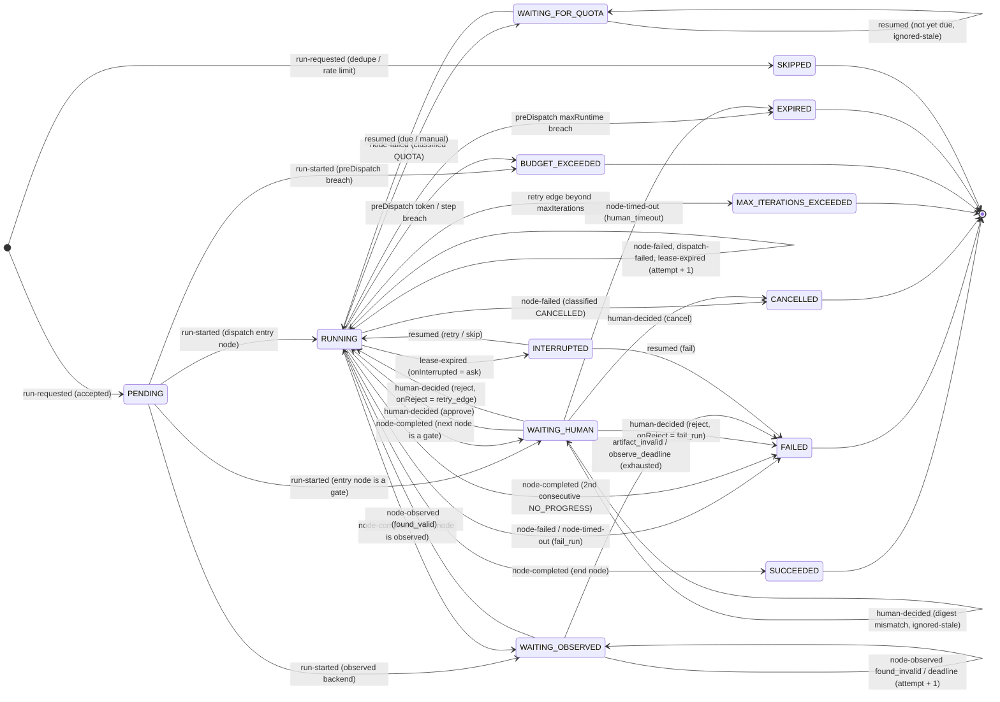
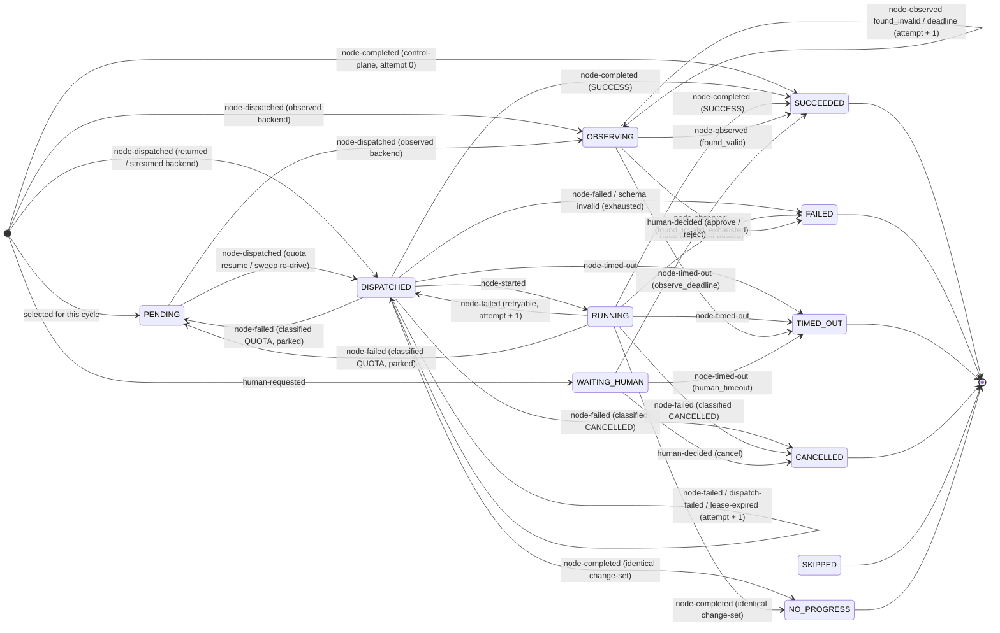
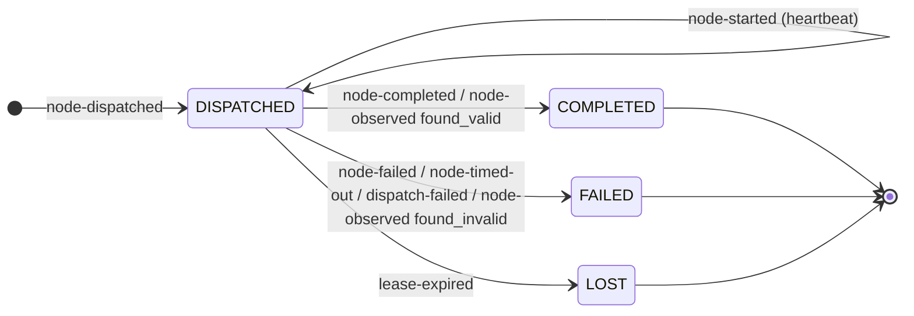

# Loopmill state machine specification

Status: normative for v0.5. This document is what the engine is built from.

Binding input: the v0.5 decision sheet (positioning brief 2026-09-06). Where this document and any
older document disagree, the decision sheet wins; where the decision sheet is silent, this document
decides and marks the decision explicitly as **Decision (not in sheet)**.

Shape: the control plane's routing decision is a single pure function over the folded run state — no
resident loop, no closure state, no clock reads inside a guard. Error classes are ranked rather than
merged, because the classes differ in what iterating can fix: a parked wait, an infrastructure error
and a configuration error can never be repaired by another cycle, while a transient failure and a
negative verdict both feed the next cycle. On top of the numeric iteration cap, Loopmill carries a
semantic stop condition (section 6.6) so a loop that is not converging stops before it grinds its
whole budget.

Companion data file: [`state-machine.json`](./state-machine.json) is the machine-readable form of the
transition tables in section 4, the event catalogue in section 3, and the enums used throughout. The
two files must agree; a test asserts it (invariant I-30).

---

## Table of contents

1. [Scope and the three machines](#1-scope-and-the-three-machines)
2. [States](#2-states)
3. [Event catalogue](#3-event-catalogue)
4. [Transition tables](#4-transition-tables)
5. [The `transition` contract](#5-the-transition-contract)
6. [Retry Edge and Cycle semantics](#6-retry-edge-and-cycle-semantics)
7. [Quota semantics](#7-quota-semantics)
8. [Human gates](#8-human-gates)
9. [Observed backends](#9-observed-backends)
10. [Lease and interruption](#10-lease-and-interruption)
11. [Budget checks](#11-budget-checks)
12. [Exit codes and the job summary](#12-exit-codes-and-the-job-summary)
13. [Worked traces](#13-worked-traces)
14. [Invariants](#14-invariants)
15. [Index of decisions not in the sheet](#15-index-of-decisions-not-in-the-sheet)

---

## 1. Scope and the three machines

### 1.1 What this document covers

This specification defines the complete control-flow semantics of a Loopmill Run: which states exist,
which events move between them, what each transition is allowed to emit and to do, and what must be
true after every step. It is the contract implemented by `transition()` (section 5) and consumed by
`loopmill step`, `loopmill run`, the sweep, and `loopmill status`.

It does **not** cover: the loop file schema and validator (decision sheet §3), backend capability
records and dispatchers (§4), the envelope wire format beyond the fields the machines read (§7), the
state store layout and CAS protocol (§8), the security boundary (§9), or usage arithmetic (§10). Those
are separate specs; this one references them where a guard depends on them.

### 1.2 The three machines

Loopmill runs three nested state machines. They are folded from the same append-only event log and
live in the same snapshot; they are separate machines because they have separate lifetimes, separate
identities, and separate terminal vocabularies.

| Machine | Identity | Lifetime | Cardinality |
|---|---|---|---|
| **Run** | `runId` (`run_` + 26-char ULID) | one trigger to one terminal Outcome | one per Run |
| **Node Execution** | `(runId, cycleIndex, nodeId)` | one scheduling of a Node in one Cycle | many per Run |
| **Attempt** | `(runId, cycleIndex, nodeId, attempt)` | one dispatch to a backend | 1..`maxAttempts` (+ quota re-dispatches) per Node Execution |

### 1.3 How they nest

```
Run  (runId)
 └── Cycle  (runId, cycleIndex)                    -- a label, not a machine (section 6)
      └── Node Execution  (runId, cycleIndex, nodeId)
           └── Attempt  (runId, cycleIndex, nodeId, attempt)
```

Nesting rules, all normative:

- **N-1.** A Run has **at most one non-terminal Node Execution** at any time. The MVP is strictly
  sequential (decision sheet §3, "MVP: one repo, sequential execution"). `snapshot.current` names it,
  or is `null` when the Run holds no in-flight node (`PENDING`, terminal, or `INTERRUPTED` after an
  abandoned node).
- **N-2.** A Node Execution has **at most one non-terminal Attempt** at any time. Earlier attempts are
  always terminal (`COMPLETED`, `FAILED`, `LOST`) before a later one is dispatched.
- **N-3.** The Run's state is a **function of** the current Node Execution's state plus Run-level
  concerns (budgets, leases, terminal outcome). The mapping is total:

  | Current Node Execution state | Run state |
  |---|---|
  | `PENDING`, `DISPATCHED`, `RUNNING` | `RUNNING` |
  | `OBSERVING` | `WAITING_OBSERVED` |
  | `WAITING_HUMAN` | `WAITING_HUMAN` |
  | `PENDING` **and** `snapshot.quota != null` | `WAITING_FOR_QUOTA` |
  | none (`current == null`), Run not terminal | `PENDING` or `INTERRUPTED` |
  | any, after the sweep loses the lease and the node is not auto-retryable | `INTERRUPTED` |

  This is invariant I-05; it means the Run state is never independently writable and can always be
  recomputed from the fold.
- **N-4.** An event that names `(cycle, nodeId, attempt)` drives **all three** machines in one
  application: the Attempt first, then the Node Execution, then the Run. The order matters because the
  Node Execution's guard reads the post-application Attempt state, and the Run's guard reads the
  post-application Node Execution state.
- **N-5.** Cycle is **not** a machine. It is an integer label on Node Executions plus two counters per
  Retry Edge (`traversals`, `freeTraversals`). It has no states and no events of its own;
  `retry-edge-taken` is a Run-level event that changes those counters.

### 1.4 Where the machines run

Every transition is computed by the pure function `transition()` inside one `loopmill step`
invocation. No process is resident between events. The sweep (`loopmill sweep`, also run at the head
of `resume`, `status` and every scheduled control-plane job) synthesises the time-driven events
(`lease-expired`, `node-timed-out`) that no backend will ever send; it does not itself hold state.

---

## 2. States

Terminal flags below are per machine. "Terminal" means: no event can ever move the entity out of that
state; every later event addressed to it is `ignored-stale` (or `duplicate` if it is an exact
redelivery).

### 2.1 Run states

| State | Terminal | One-line definition |
|---|---|---|
| `PENDING` | no | The Run record exists, `loopVersion` is pinned, dedupe and rate checks have passed; no node has been selected yet. |
| `RUNNING` | no | Exactly one Node Execution is in `PENDING`/`DISPATCHED`/`RUNNING`; the attempt lease is held. |
| `WAITING_HUMAN` | no | A `human` node is awaiting a decision; no lease is held and the `maxRuntime` clock is paused. |
| `WAITING_FOR_QUOTA` | no | The last attempt was classified `QUOTA` with a `quotaResetsAt`; the Run is parked until `resumeDueAt`. |
| `WAITING_OBSERVED` | no | A node on an `observed` backend has been triggered and Loopmill is watching for its artifact until a deadline. |
| `INTERRUPTED` | no | The attempt lease expired and the node could not be safely auto-re-dispatched; recoverable only by `loopmill resume`. |
| `SUCCEEDED` | **yes** | The Run reached an `end` node. |
| `FAILED` | **yes** | A node failed and the failure propagated to the Run under `onFailure: fail_run`, or the loop stalled. |
| `CANCELLED` | **yes** | A human or the platform cancelled the Run or its in-flight job. |
| `MAX_ITERATIONS_EXCEEDED` | **yes** | A Retry Edge would have been traversed beyond its `maxIterations`. Never reported as `FAILED`. |
| `BUDGET_EXCEEDED` | **yes** | A pre-dispatch budget check (tokens, unmeasured executions, steps) breached. |
| `EXPIRED` | **yes** | `maxRuntime` elapsed, or a human gate passed its `timeout`. |
| `SKIPPED` | **yes** | The Run was refused at request time: an open change exists for the same `dedupeKey`, or the Loop's rate limits forbid starting. |

### 2.2 The Outcome carried by terminal Run states

Every terminal Run state carries exactly one `Outcome` object, written once into the single
`run-finished` event and copied into `snapshot.outcome`. `Outcome.state` always equals the terminal Run
state; the discriminated payload is what makes two runs that both stopped comparable.

```ts
type Outcome =
  | { state: 'SUCCEEDED';               label: string }                         // end node's outcome label
  | { state: 'FAILED';                  failureReason: FailureReason; nodeId?: string; cycleIndex?: number }
  | { state: 'CANCELLED';               by: 'human' | 'platform' | 'timeout-escalation'; actor?: string }
  | { state: 'MAX_ITERATIONS_EXCEEDED'; edgeId: string; traversals: number; maxIterations: number }
  | { state: 'BUDGET_EXCEEDED';         budgetKey: BudgetKey; limit: number; observed: number }
  | { state: 'EXPIRED';                 expiryReason: 'max_runtime' | 'human_timeout'; nodeId?: string }
  | { state: 'SKIPPED';                 skipReason: 'dedupe' | 'min_interval' | 'runs_per_window'; ref?: string }
```

`SUCCEEDED` is rendered `SUCCEEDED(end:<label>)` (decision sheet §3, End node). The two labels the
reference loop uses are `no_change` and `shipped`; custom labels are allowed by the loop file.

`FailureReason` (closed enum, extendable only by a schema version bump):

```
node_failed          a node's attempts were exhausted with a FAILED classification
node_timed_out       a node hit its own timeout and onFailure was fail_run
attempts_exhausted   maxAttempts reached through LOST / dispatch-failed attempts
dispatch_failed      the backend dispatcher refused, attempts exhausted
artifact_invalid     an observed backend's artifact was found but did not parse or validate
observe_deadline     an observed backend produced no artifact before its deadline
condition_error      a condition node's input was missing or non-conforming
schema_invalid       an agent node's structured output did not conform to its declared schema
no_progress_stalled  two consecutive NO_PROGRESS cycles (section 6.6)
quota_unclassifiable classification was QUOTA but no reset time could be resolved (section 7.3)
quota_parks_exhausted  maxQuotaParks reached for one node execution
human_rejected       a human gate was rejected and onReject was fail_run
interrupted_abandoned  a human resumed an INTERRUPTED run with decision=fail
validation_error     an inbound envelope that was structurally valid was rejected against the pinned loop
```

`BudgetKey`: `maxMeasuredTokens | maxUnmeasuredExecutions | maxStepsPerRun`. (`maxIterations`,
`maxRuntime`, `maxAttempts` have their own terminal states or node-level handling and never appear
here — invariant I-19.)

### 2.3 Node Execution states

| State | Terminal | One-line definition |
|---|---|---|
| `PENDING` | no | The node has been selected for this Cycle (or un-parked from quota) but no `node-dispatched` has been recorded for the pending attempt. |
| `DISPATCHED` | no | `node-dispatched` recorded; an Attempt is in `DISPATCHED`; the backend has been asked to run, or is about to be. |
| `RUNNING` | no | `node-started` received. Only backends whose capability is `result: streamed` (or that opt in) ever produce this; `result: returned` backends go straight from `DISPATCHED` to a terminal state. |
| `OBSERVING` | no | An `observed` backend was triggered; Loopmill is running the artifact matcher until `observeDeadlineAt`. |
| `WAITING_HUMAN` | no | `human-requested` recorded, awaiting `human-decided`. |
| `SUCCEEDED` | **yes** | The node produced a valid result (including a *negative verdict* — a verdict is data, not a failure; see 3.4). |
| `FAILED` | **yes** | Attempts exhausted with a `FAILED` classification, or a matcher/schema rejection. |
| `TIMED_OUT` | **yes** | The node's own `timeout`, the observe deadline, or a human gate timeout elapsed. |
| `CANCELLED` | **yes** | The attempt was cancelled (SIGINT-with-result, job cancel, or `human-decided: cancel`). |
| `SKIPPED` | **yes** | The node was not executed: an `onFailure: continue` skip-forward, a human `resume --decision skip`, or a branch not taken that still needs a record. |
| `NO_PROGRESS` | **yes** | An agent node inside a Retry Edge body produced a change-set byte-identical to its own previous cycle. Does **not** consume the iteration budget (section 6.6). |

### 2.4 Attempt states

| State | Terminal | One-line definition |
|---|---|---|
| `DISPATCHED` | no | `node-dispatched` recorded; the attempt owns the lease until `deadlineAt`. |
| `COMPLETED` | **yes** | A terminal report arrived with classification `SUCCESS` (`node-completed` or `node-observed: found_valid`). |
| `FAILED` | **yes** | A terminal report arrived with classification `FAILED`, `QUOTA`, `TIMEOUT` or `CANCELLED`. The classification is a field, not a state. |
| `LOST` | **yes** | No completion arrived by `deadlineAt`; the sweep declared it lost. A new Attempt may be dispatched up to `maxAttempts` (default 2). |

Every Attempt carries `classification: Classification` (section 7.1), `usage` (decision sheet §10) and
`artifactRefs[]`. `LOST` attempts carry `usage.provenance = 'unavailable'` with all buckets `null` and
`complete: false` — never zeros (decision sheet §10; review finding observability-data-4).

---

## 3. Event catalogue

All seventeen MVP event types from the decision sheet §7. Every envelope carries the common required
fields; the table lists what each type adds.

**Common required fields (all events):** `schemaVersion`, `eventId` (ULID), `eventType`, `occurredAt`
(RFC 3339, producer clock), `producer`, `loopId`, `loopVersion`, `runId`.
**Per-node events add:** `cycle`, `nodeId`, `attempt`.
**Optional on any event:** `causationId`, `correlationId`, `result`, `artifactRefs[]`, `usage`,
`error`, `signature`.

### 3.1 The catalogue

| # | eventType | Producer(s) | Adds (required) | Drives |
|---|---|---|---|---|
| 1 | `run-requested` | `trigger`, `control-plane` (reconcile) | `trigger{kind: manual\|schedule\|event, source?, dedupeKey?, requestedAt}` | Run |
| 2 | `run-started` | `control-plane` | — | Run |
| 3 | `node-dispatched` | `control-plane` | `cycle`, `nodeId`, `attempt`, `dispatch{backendId, runtimeId?, authMode, deadlineAt, dedupeKey}` | Run, Node, Attempt |
| 4 | `node-started` | `backend:<id>` | `cycle`, `nodeId`, `attempt`, `runHandle?` | Node, Attempt (heartbeat) |
| 5 | `node-completed` | `backend:<id>`, `control-plane` (condition/end/synthetic) | `cycle`, `nodeId`, `attempt`, `result{status: 'SUCCESS', exitCode?, structured?, summary?}`; `filesChanged[]?`, `usage?` | Run, Node, Attempt |
| 6 | `node-failed` | `backend:<id>` | `cycle`, `nodeId`, `attempt`, `result{status: 'FAILED'\|'QUOTA'\|'CANCELLED', exitCode?}`, `error{code, message, classified}`; for QUOTA also `error{quotaResetsAt, quotaWindow, quotaSource}` | Run, Node, Attempt |
| 7 | `node-timed-out` | `backend:<id>`, `control-plane` (sweep) | `cycle`, `nodeId`, `attempt?`, `error{code: 'node_timeout'\|'observe_deadline'\|'human_timeout'}` | Run, Node, Attempt (when `attempt` present) |
| 8 | `node-observed` | `backend:observed` | `cycle`, `nodeId`, `attempt`, `matcher{kind: 'comment-block'\|'file-in-diff'\|'cloud-status', ref, outcome: 'found_valid'\|'found_invalid'}`, `result` when `found_valid` | Run, Node, Attempt |
| 9 | `human-requested` | `control-plane` | `cycle`, `nodeId`, `attempt`, `gate{mode, subject{kind, ref, digest}, expiresAt}` | Run, Node |
| 10 | `human-decided` | `human` (via the `ingest` workflow) | `cycle`, `nodeId`, `decision: 'approve'\|'reject'\|'cancel'`, `subjectDigest`, `actor` | Run, Node |
| 11 | `quota-parked` | `control-plane` | `cycle`, `nodeId`, `attempt`, `quota{quotaResetsAt, resumeDueAt, window, source, parks}` | Run |
| 12 | `retry-edge-taken` | `control-plane` | `edgeId`, `fromNodeId`, `toNodeId`, `fromCycle`, `toCycle`, `traversals`, `budgetConsumed: bool` | Run |
| 13 | `run-finished` | `control-plane` | `outcome` (section 2.2), `artifactRefs[]`, `summary` (section 12.3) | Run |
| 14 | `ignored-stale` | `control-plane` | `ignored{eventId, eventType, cycle?, nodeId?, attempt?}`, `reason: StaleReason` | none (audit only) |
| 15 | `dispatch-failed` | `control-plane` | `cycle`, `nodeId`, `attempt`, `error{code, message}` | Run, Node, Attempt |
| 16 | `resumed` | `human`, `control-plane` (`resume --due`) | `resume{kind: 'due'\|'manual'\|'interrupted', decision?: 'retry'\|'skip'\|'fail', actor?}` | Run |
| 17 | `lease-expired` | `control-plane` (sweep) | `cycle`, `nodeId`, `attempt`, `reason: 'attempt_deadline'\|'control_plane_lease'\|'observe_deadline'` | Run, Node, Attempt |

### 3.2 Producer allowlist

`loopmill step` rejects (exit 2) any envelope whose `producer` is not allowed for its `eventType`
(decision sheet §6, validation step 2). The allowlist is exactly the "Producer(s)" column above. Two
consequences worth stating:

- A backend can never emit `node-dispatched`, `retry-edge-taken`, `run-finished`, `quota-parked` or
  `ignored-stale`. Only the control plane mints control-flow facts. This is what makes
  duplicate-dispatch detection and the stale-attempt rule sound (section 5.5).
- A `human` producer can emit only `human-decided` and `resumed`. Human intent reaches the machine
  through the `ingest` workflow, which converts a GitHub review / label / environment approval into a
  signed envelope; free text is never parsed as control flow (decision sheet §7).

### 3.3 Inbound versus emitted

**Inbound** (may arrive from outside one `step`): `run-requested`, `node-started`, `node-completed`,
`node-failed`, `node-timed-out`, `node-observed`, `human-decided`, `resumed`, `lease-expired`.

**Emitted** (produced by `transition()` inside a step and persisted in the same commit): `run-started`,
`node-dispatched`, `human-requested`, `quota-parked`, `retry-edge-taken`, `run-finished`,
`ignored-stale`, `dispatch-failed`.

`node-completed` and `node-timed-out` appear in both lists: the control plane synthesises them for
control-plane-local nodes and for the sweep respectively (see 3.4 and section 10).

### 3.4 Two modelling rules that the catalogue depends on

**Decision (not in sheet) D-14 — a verdict is not a failure.** `node-completed` carries
`result.status: 'SUCCESS'` only. A node that ran correctly and reported a *negative verdict* (the
reviewer rejected the change, the condition evaluated false) is `SUCCEEDED`; the verdict lives in
`result.structured` and drives **routing**, not the node state. Failures use `node-failed` /
`node-timed-out`. This removes the ambiguity the SPIKE-3 prototype had, where a single `status` field
mixed `fail` (a verdict) with `error` (an execution failure), and it is what lets the Retry Edge fire
from a *successful* review.

**Decision (not in sheet) D-13 — condition, end and synthetic nodes are control-plane-local.**
`condition` and `end` nodes, and any node the engine resolves without a backend (a skip-forward, an
approved gate's completion record), produce a Node Execution that goes `PENDING` → terminal inside one
step, with a synthetic `node-completed` whose `producer` is `control-plane` and whose `attempt` is `0`.
They create **no Attempt record**, consume no `maxAttempts`, and carry no usage. `attempt: 0` is
reserved for exactly this and is never dispatched. A condition whose input is missing or non-conforming
emits `node-completed` with `result.status: 'SUCCESS'` **only** when it evaluates; otherwise the step
emits `node-failed` with `error.code: condition_error` and producer `control-plane` — never a silent
`false` (decision sheet §3).

---

## 4. Transition tables

Notation used in all three tables:

- `∅` — the entity does not exist yet.
- `*` — any state of that machine.
- **Guard** — a boolean over `(snapshot, event, loop, ctx.now, policy)` only. Guards never read a wall
  clock directly and never read `event.occurredAt` (invariant I-11).
- **Emits** — envelopes appended in the same commit, in the listed order.
- **Side effects** — actions returned to the impure shell: `dispatch(backend, node, attempt)`,
  `request-approval(mode, subject)`, `observe(matcher, deadline)`, `wait(until)`, `finish(outcome)`.
  `transition()` performs none of them; it only describes them.

Common guard blocks referenced by name:

- **`preDispatch(node, cycle)`** — the ordered budget/iteration check of section 11.2. Returns `ok` or
  the terminal Outcome to finish with.
- **`route(node, result)`** — the loop-file routing decision for a node that terminated successfully:
  `next(nodeId)` | `retryEdge(edgeId)` | `end(label)` | `humanGate(nodeId)`.
- **`retryable(node, attempt)`** — `chargedAttempts(cycle,nodeId) < node.maxAttempts` **and** the
  node's backend declares `retryable: true`.

### 4.1 Run machine

| # | From | Event | Guard | To | Emits | Side effects |
|---|---|---|---|---|---|---|
| R-01 | `∅` | `run-requested` | envelope valid; loop file validates against the pinned `loopVersion`; no open change for `trigger.dedupeKey`; `minInterval` and `maxRunsPerWindow` satisfied | `PENDING` | `run-started` | — |
| R-02 | `∅` | `run-requested` | an open change exists for `trigger.dedupeKey` | `SKIPPED` | `run-finished(SKIPPED, dedupe)` | `finish` |
| R-03 | `∅` | `run-requested` | `minInterval` or `maxRunsPerWindow` breached | `SKIPPED` | `run-finished(SKIPPED, min_interval\|runs_per_window)` | `finish` |
| R-04 | `∅` | `run-requested` | loop file fails validation | `∅` (nothing persisted) | — | `invalid` → exit 2 |
| R-05 | `PENDING` | `run-started` | entry node dispatchable; `preDispatch` = ok | `RUNNING` | `node-dispatched` | `dispatch` |
| R-06 | `PENDING` | `run-started` | entry node `kind: human` | `WAITING_HUMAN` | `human-requested` | `request-approval` |
| R-07 | `PENDING` | `run-started` | entry node's backend has `result: observed`; `preDispatch` = ok | `WAITING_OBSERVED` | `node-dispatched` | `observe` |
| R-08 | `PENDING` | `run-started` | `preDispatch` ≠ ok | that Outcome's state | `run-finished(outcome)` | `finish` |
| R-09 | `RUNNING` | `node-completed` | node terminal `SUCCEEDED`; `route` = `next(n)`; `preDispatch(n)` = ok; `n` is a normal node | `RUNNING` | `node-dispatched` | `dispatch` |
| R-10 | `RUNNING` | `node-completed` | as R-09 but `n.kind = human` | `WAITING_HUMAN` | `human-requested` | `request-approval` |
| R-11 | `RUNNING` | `node-completed` | as R-09 but `n`'s backend is `result: observed` | `WAITING_OBSERVED` | `node-dispatched` | `observe` |
| R-12 | `RUNNING` | `node-completed` | `route` = `end(label)` | `SUCCEEDED` | `run-finished(SUCCEEDED, label)` | `finish` |
| R-13 | `RUNNING` | `node-completed` | `route` = `retryEdge(e)`; `traversals[e] < maxIterations[e]`; `preDispatch(e.to)` = ok | `RUNNING` | `retry-edge-taken(budgetConsumed: true)`, `node-dispatched` | `dispatch` |
| R-14 | `RUNNING` | `node-completed` | `route` = `retryEdge(e)`; `traversals[e] >= maxIterations[e]` | `MAX_ITERATIONS_EXCEEDED` | `run-finished(MAX_ITERATIONS_EXCEEDED, e, traversals, max)` | `finish` |
| R-15 | `RUNNING` | `node-completed` | node terminal `NO_PROGRESS`; `noProgressStreak` after this event `< 2`; `freeTraversals[e] < maxIterations[e]` | `RUNNING` | `retry-edge-taken(budgetConsumed: false)`, `node-dispatched` | `dispatch` |
| R-16 | `RUNNING` | `node-completed` | node terminal `NO_PROGRESS`; `noProgressStreak` after this event `>= 2` | `FAILED` | `run-finished(FAILED, no_progress_stalled)` | `finish` |
| R-17 | `RUNNING` | `node-completed` | node terminal `NO_PROGRESS`; `freeTraversals[e] >= maxIterations[e]` | `MAX_ITERATIONS_EXCEEDED` | `run-finished(MAX_ITERATIONS_EXCEEDED, e)` | `finish` |
| R-18 | `RUNNING` | `node-failed` | `classified = FAILED`; `retryable(node, attempt)` | `RUNNING` | `node-dispatched(attempt+1)` | `dispatch` |
| R-19 | `RUNNING` | `node-failed` | `classified = FAILED`; not retryable; `node.onFailure = fail_run` | `FAILED` | `run-finished(FAILED, node_failed)` | `finish` |
| R-20 | `RUNNING` | `node-failed` | `classified = FAILED`; not retryable; `node.onFailure = continue`; `preDispatch(next)` = ok | `RUNNING` | `node-completed(SKIPPED, control-plane)`, `node-dispatched(next)` | `dispatch` |
| R-21 | `RUNNING` | `node-failed` | `classified = FAILED`; not retryable; `node.onFailure = retry_edge:e`; `traversals[e] < max` | `RUNNING` | `retry-edge-taken(true)`, `node-dispatched` | `dispatch` |
| R-22 | `RUNNING` | `node-failed` | `classified = FAILED`; not retryable; `node.onFailure = retry_edge:e`; `traversals[e] >= max` | `MAX_ITERATIONS_EXCEEDED` | `run-finished(...)` | `finish` |
| R-23 | `RUNNING` | `node-failed` | `classified = QUOTA`; `quotaResetsAt` resolvable (7.3); `quota.parks < maxQuotaParks` | `WAITING_FOR_QUOTA` | `quota-parked` | `wait(resumeDueAt)` |
| R-24 | `RUNNING` | `node-failed` | `classified = QUOTA`; `quotaResetsAt` not resolvable | `FAILED` | `run-finished(FAILED, quota_unclassifiable)` | `finish` |
| R-25 | `RUNNING` | `node-failed` | `classified = QUOTA`; `quota.parks >= maxQuotaParks` | `FAILED` | `run-finished(FAILED, quota_parks_exhausted)` | `finish` |
| R-26 | `RUNNING` | `node-failed` | `classified = CANCELLED` | `CANCELLED` | `run-finished(CANCELLED, platform)` | `finish` |
| R-27 | `RUNNING` | `node-timed-out` | `error.code = node_timeout`; `retryable(node, attempt)` and `node.effects = none` | `RUNNING` | `node-dispatched(attempt+1)` | `dispatch` |
| R-28 | `RUNNING` | `node-timed-out` | `error.code = node_timeout`; otherwise; `node.onFailure = fail_run` | `FAILED` | `run-finished(FAILED, node_timed_out)` | `finish` |
| R-29 | `RUNNING` | `dispatch-failed` | `retryable(node, attempt)` | `RUNNING` | `node-dispatched(attempt+1)` | `dispatch` |
| R-30 | `RUNNING` | `dispatch-failed` | not retryable | `FAILED` | `run-finished(FAILED, dispatch_failed)` | `finish` |
| R-31 | `RUNNING` | `lease-expired` | `node.onInterrupted = retry`; `retryable(node, attempt)` | `RUNNING` | `node-dispatched(attempt+1)` | `dispatch` |
| R-32 | `RUNNING` | `lease-expired` | `node.onInterrupted = ask`, **or** not retryable and `node.effects = external` | `INTERRUPTED` | — | `wait(∞)` |
| R-33 | `RUNNING` | `lease-expired` | not retryable; `node.effects = none`; `node.onFailure = fail_run` | `FAILED` | `run-finished(FAILED, attempts_exhausted)` | `finish` |
| R-34 | `WAITING_HUMAN` | `human-decided` | `decision = approve`; `subjectDigest` matches `pendingApproval.subject.digest`; `route(next)`; `preDispatch` = ok | `RUNNING` | `node-completed(control-plane)`, `node-dispatched` | `dispatch` |
| R-35 | `WAITING_HUMAN` | `human-decided` | `decision = reject`; digest matches; `node.onReject = fail_run` | `FAILED` | `node-completed(control-plane)`, `run-finished(FAILED, human_rejected)` | `finish` |
| R-36 | `WAITING_HUMAN` | `human-decided` | `decision = reject`; digest matches; `node.onReject = retry_edge:e`; `traversals[e] < max` | `RUNNING` | `node-completed`, `retry-edge-taken(true)`, `node-dispatched` | `dispatch` |
| R-37 | `WAITING_HUMAN` | `human-decided` | `decision = cancel`; digest matches | `CANCELLED` | `node-completed(CANCELLED)`, `run-finished(CANCELLED, human)` | `finish` |
| R-38 | `WAITING_HUMAN` | `human-decided` | `subjectDigest` does **not** match | `WAITING_HUMAN` | `ignored-stale(approval_subject_mismatch)` | — |
| R-39 | `WAITING_HUMAN` | `node-timed-out` | `error.code = human_timeout`; `ctx.now >= pendingApproval.expiresAt` | `EXPIRED` | `run-finished(EXPIRED, human_timeout)` | `finish` |
| R-40 | `WAITING_FOR_QUOTA` | `resumed` | `resume.kind = due`; `ctx.now >= quota.resumeDueAt`; `preDispatch` = ok | `RUNNING` | `node-dispatched(attempt+1)` | `dispatch` |
| R-41 | `WAITING_FOR_QUOTA` | `resumed` | `resume.kind = manual` | `RUNNING` | `node-dispatched(attempt+1)` | `dispatch` |
| R-42 | `WAITING_FOR_QUOTA` | `resumed` | `resume.kind = due`; `ctx.now < quota.resumeDueAt` | `WAITING_FOR_QUOTA` | `ignored-stale(not_due)` | — |
| R-43 | `WAITING_OBSERVED` | `node-observed` | `outcome = found_valid`; then the R-09..R-17 fan-out applies to the routed node | per fan-out | per fan-out | per fan-out |
| R-44 | `WAITING_OBSERVED` | `node-observed` | `outcome = found_invalid`; `retryable(node, attempt)` | `WAITING_OBSERVED` | `node-dispatched(attempt+1)` | `observe` |
| R-45 | `WAITING_OBSERVED` | `node-observed` | `outcome = found_invalid`; not retryable; `onFailure = fail_run` | `FAILED` | `run-finished(FAILED, artifact_invalid)` | `finish` |
| R-46 | `WAITING_OBSERVED` | `node-timed-out` | `error.code = observe_deadline`; `retryable(node, attempt)` | `WAITING_OBSERVED` | `node-dispatched(attempt+1)` | `observe` |
| R-47 | `WAITING_OBSERVED` | `node-timed-out` | `error.code = observe_deadline`; not retryable; `onFailure = fail_run` | `FAILED` | `run-finished(FAILED, observe_deadline)` | `finish` |
| R-48 | `INTERRUPTED` | `resumed` | `resume.decision = retry`; `preDispatch` = ok | `RUNNING` | `node-dispatched(attempt+1)` | `dispatch` |
| R-49 | `INTERRUPTED` | `resumed` | `resume.decision = skip`; a `next` exists | `RUNNING` | `node-completed(SKIPPED, control-plane)`, `node-dispatched(next)` | `dispatch` |
| R-50 | `INTERRUPTED` | `resumed` | `resume.decision = fail` | `FAILED` | `run-finished(FAILED, interrupted_abandoned)` | `finish` |
| R-51 | `RUNNING`, `WAITING_*`, `INTERRUPTED` | `run-requested` | — | unchanged | `ignored-stale(run_already_started)` | — |
| R-52 | `PENDING` | any except `run-started`, `run-finished` | — | unchanged | `ignored-stale(run_not_started)` | — |
| R-53 | any terminal | any | not an exact `eventId` duplicate | unchanged | `ignored-stale(run_terminal)` | — |
| R-54 | any | any | `event.eventId ∈ appliedEventIds ∪ ignoredEventIds` | unchanged | — (nothing written) | `duplicate` → exit 0 |
| R-55 | any non-terminal | any per-node event | `(cycle, nodeId, attempt)` ≠ `snapshot.current` | unchanged | `ignored-stale(<stale reason>)` | — |
| R-56 | any | `run-started`, `node-dispatched`, `retry-edge-taken`, `quota-parked`, `run-finished`, `ignored-stale`, `dispatch-failed` from a non-`control-plane` producer | — | unchanged | — | `invalid` → exit 2 |

Note on R-08, R-14, R-17, R-22: a Run may terminate on a **guard**, without any node reporting a
failure. This is the "check before dispatch" discipline (decision sheet §5, §10): the budget and the
iteration cap are enforced *before* spending, never by killing work in flight.



### 4.2 Node Execution machine

| # | From | Event | Guard | To | Emits | Side effects |
|---|---|---|---|---|---|---|
| N-01 | `∅` | `node-dispatched` | backend `result ≠ observed` | `DISPATCHED` | — | `dispatch` |
| N-02 | `∅` | `node-dispatched` | backend `result = observed` | `OBSERVING` | — | `observe` |
| N-03 | `∅` | `human-requested` | `node.kind = human` | `WAITING_HUMAN` | — | `request-approval` |
| N-04 | `∅` | `node-completed` | `producer = control-plane`, `attempt = 0` (condition / end / synthetic) | `SUCCEEDED` | — | — |
| N-05 | `∅` | `node-completed` | `producer = control-plane`, `result.structured.skipped = true` | `SKIPPED` | — | — |
| N-06 | `PENDING` | `node-dispatched` | un-parked from quota, or re-driven by the sweep | `DISPATCHED` / `OBSERVING` | — | `dispatch` / `observe` |
| N-07 | `DISPATCHED` | `node-started` | attempt matches `current` | `RUNNING` | — | heartbeat |
| N-08 | `DISPATCHED`, `RUNNING` | `node-completed` | `result.status = SUCCESS`; structured output validates; NO_PROGRESS rule (6.6) does **not** fire | `SUCCEEDED` | — | — |
| N-09 | `DISPATCHED`, `RUNNING` | `node-completed` | `result.status = SUCCESS`; NO_PROGRESS rule fires | `NO_PROGRESS` | — | — |
| N-10 | `DISPATCHED`, `RUNNING` | `node-completed` | `result.status = SUCCESS`; declared `structuredOutput` does not validate | `FAILED` (`schema_invalid`) | — | — |
| N-11 | `DISPATCHED`, `RUNNING` | `node-failed` | `classified = FAILED`; `retryable` | `DISPATCHED` (attempt+1) | — | `dispatch` |
| N-12 | `DISPATCHED`, `RUNNING` | `node-failed` | `classified = FAILED`; not retryable | `FAILED` | — | — |
| N-13 | `DISPATCHED`, `RUNNING` | `node-failed` | `classified = QUOTA`, park accepted | `PENDING` | — | `wait` |
| N-14 | `DISPATCHED`, `RUNNING` | `node-failed` | `classified = CANCELLED` | `CANCELLED` | — | — |
| N-15 | `DISPATCHED`, `RUNNING` | `node-timed-out` | `node_timeout`; retry not available | `TIMED_OUT` | — | — |
| N-16 | `DISPATCHED`, `RUNNING` | `node-timed-out` | `node_timeout`; retry available and `effects = none` | `DISPATCHED` (attempt+1) | — | `dispatch` |
| N-17 | `DISPATCHED`, `RUNNING`, `OBSERVING` | `lease-expired` | retry available and `onInterrupted = retry` | `DISPATCHED` / `OBSERVING` (attempt+1) | — | `dispatch` / `observe` |
| N-18 | `DISPATCHED`, `RUNNING`, `OBSERVING` | `lease-expired` | not retryable, `effects = none` | `FAILED` (`attempts_exhausted`) | — | — |
| N-19 | `DISPATCHED`, `RUNNING`, `OBSERVING` | `lease-expired` | `onInterrupted = ask` | unchanged (frozen) | — | Run → `INTERRUPTED` |
| N-20 | `DISPATCHED` | `dispatch-failed` | retryable | `DISPATCHED` (attempt+1) | — | `dispatch` |
| N-21 | `DISPATCHED` | `dispatch-failed` | not retryable | `FAILED` (`dispatch_failed`) | — | — |
| N-22 | `OBSERVING` | `node-observed` | `outcome = found_valid`; structured output validates | `SUCCEEDED` | — | — |
| N-23 | `OBSERVING` | `node-observed` | `outcome = found_invalid`, or found but non-conforming; not retryable | `FAILED` (`artifact_invalid`) | — | — |
| N-24 | `OBSERVING` | `node-observed` | `outcome = found_invalid`; retryable | `OBSERVING` (attempt+1) | — | `observe` |
| N-25 | `OBSERVING` | `node-timed-out` | `observe_deadline`; not retryable | `TIMED_OUT` | — | — |
| N-26 | `WAITING_HUMAN` | `human-decided` | `decision = approve`, digest matches | `SUCCEEDED` (`structured.decision = "approve"`) | — | — |
| N-27 | `WAITING_HUMAN` | `human-decided` | `decision = reject`, digest matches | `SUCCEEDED` (`structured.decision = "reject"`) | — | — |
| N-28 | `WAITING_HUMAN` | `human-decided` | `decision = cancel`, digest matches | `CANCELLED` | — | — |
| N-29 | `WAITING_HUMAN` | `node-timed-out` | `human_timeout` | `TIMED_OUT` | — | — |
| N-30 | any terminal | any | — | unchanged | `ignored-stale(node_terminal)` | — |
| N-31 | `∅` | any except `node-dispatched`, `human-requested`, control-plane `node-completed` | — | unchanged | `ignored-stale(no_attempt_in_flight)` | — |

A rejected gate leaves the Node Execution `SUCCEEDED` (N-27): the gate did its job. The *Run* consequence
of a rejection is the Run machine's business (R-35 / R-36). This separation is what lets the reference
loop's "if rejected, control returns to Claude Code" arc be a Retry Edge rather than a failure path.



### 4.3 Attempt machine

| # | From | Event | Guard | To | Records |
|---|---|---|---|---|---|
| A-01 | `∅` | `node-dispatched` | `attempt >= 1` | `DISPATCHED` | `backendId`, `runtimeId`, `authMode`, `dispatchedAt`, `deadlineAt`, `dedupeKey` |
| A-02 | `DISPATCHED` | `node-started` | attempt matches | `DISPATCHED` | `startedAt`, `runHandle`, `lease.heartbeatAt` |
| A-03 | `DISPATCHED` | `node-completed` | attempt matches | `COMPLETED` | `classification: SUCCESS`, `usage`, `artifactRefs`, `filesChanged` |
| A-04 | `DISPATCHED` | `node-observed` | attempt matches; `outcome = found_valid` | `COMPLETED` | `classification: SUCCESS`, `usage.provenance: unavailable` |
| A-05 | `DISPATCHED` | `node-observed` | attempt matches; `outcome = found_invalid` | `FAILED` | `classification: FAILED`, `error.code: artifact_invalid` |
| A-06 | `DISPATCHED` | `node-failed` | attempt matches | `FAILED` | `classification ∈ {FAILED, QUOTA, CANCELLED}`, `error`, `usage` if present |
| A-07 | `DISPATCHED` | `node-timed-out` | attempt matches | `FAILED` | `classification: TIMEOUT`, `usage.provenance: unavailable` |
| A-08 | `DISPATCHED` | `dispatch-failed` | attempt matches | `FAILED` | `classification: FAILED`, `error.code: dispatch_failed`, no usage |
| A-09 | `DISPATCHED` | `lease-expired` | attempt matches | `LOST` | `classification: LOST`, `usage.provenance: unavailable`, `complete: false` |
| A-10 | any terminal | any control event | — | unchanged | `ignored-stale(stale_attempt)` |
| A-11 | any terminal | any event carrying `usage` for this exact attempt | the attempt has no usage record yet | unchanged | usage appended to the ledger only (section 5.4) |



`maxAttempts` (default 2) bounds only **charged** attempts: those whose classification is `FAILED`,
`TIMEOUT` or `LOST`. `QUOTA` re-dispatches increment `attempt` for identity but are counted by
`quota.parks` against `maxQuotaParks` instead (section 7.4, D-07). `CANCELLED` terminates the Run and
never retries.

---

## 5. The `transition` contract

### 5.1 Signature

```ts
function transition(
  snapshot: RunSnapshot,          // the fold of every event applied so far; never mutated
  event: Envelope,                // exactly one inbound envelope
  ctx: TransitionContext,
): TransitionResult
```

```ts
interface TransitionContext {
  loop: ResolvedLoop      // the pinned loopVersion, already schema-validated
  now: string             // RFC 3339 — the ONLY time source; injected, never read from the clock
  policy: EnginePolicy    // engine defaults: maxAttempts, dispatchGraceSeconds, convergenceLimit,
                          // maxQuotaParks, maxStepsPerRun, quotaJitterSeconds
}

type TransitionResult =
  | { kind: 'applied';       snapshot: RunSnapshot; emitted: Envelope[]; actions: Action[] }
  | { kind: 'duplicate';     snapshot: RunSnapshot; emitted: [];         actions: [] }
  | { kind: 'ignored-stale'; snapshot: RunSnapshot; emitted: [Envelope]; actions: []; reason: StaleReason }
  | { kind: 'invalid';       snapshot: RunSnapshot; emitted: [];         actions: []; error: ValidationError }

type Action =
  | { type: 'dispatch';         backendId: string; nodeId: string; cycle: number; attempt: number; deadlineAt: string; dedupeKey: string }
  | { type: 'request-approval'; mode: GateMode; nodeId: string; cycle: number; subject: Subject; expiresAt: string }
  | { type: 'observe';          matcher: Matcher; nodeId: string; cycle: number; attempt: number; deadlineAt: string }
  | { type: 'wait';             until: string | null }
  | { type: 'finish';           outcome: Outcome }
```

`transition()` returns a *description* of the side effects. Performing them — calling the dispatcher,
posting the comment, writing the commit — belongs to the impure shell of `loopmill step` (decision
sheet §6, steps 5–6).

### 5.2 Properties

**P-1 — Pure.** No I/O, no filesystem, no network, no `Date.now()`, no `Math.random()`, no
`crypto.randomUUID()`. Every input arrives through `(snapshot, event, ctx)`. A test that freezes
`ctx.now` and replays a fixture must produce byte-identical output on any machine, in any timezone.

**P-2 — Deterministic.** Given identical `(snapshot, event, ctx)` the result is byte-identical,
including the key order of every emitted envelope and of the new snapshot. Canonical JSON
(recursively key-sorted, 2-space indent, trailing newline) is the serialisation for both — the same
rule the state store uses for its commits (decision sheet §8).

Deterministic identifiers: emitted envelopes must carry ULIDs (decision sheet §7) yet may not consume
randomness. **Decision (not in sheet) D-16:** an emitted envelope's `eventId` is a *deterministic ULID*

```
eventId = ulid(timeMs = parseRfc3339(ctx.now), entropy80 = sha256(
    runId | eventType | cycle | nodeId | attempt | emitIndex | causationEventId
).slice(0, 10 bytes))
```

This is a well-formed, time-sortable, 26-character Crockford-base32 ULID that is a pure function of its
inputs. Two consequences the engine relies on: re-running the same step after a lost CAS push produces
the same ids, so the retry is a `duplicate` rather than a second dispatch; and the sweep can safely
re-emit `run-started` for a stalled `PENDING` run (R-52 / D-22) knowing a second delivery collapses to
`duplicate`.

**P-3 — Total.** Every `(machine state, eventType)` pair in the product space is defined. There is no
"unhandled event" branch that throws. A pair not listed in section 4 resolves as follows, in order:

1. The envelope violates the schema, or its `producer` is not allowed for its `eventType`, or its
   `loopId`/`loopVersion` does not match the Run's pinned values, or it names a `nodeId` that does not
   exist in the pinned loop → `invalid` (exit 2). Nothing is persisted.
2. Otherwise → `ignored-stale` with a `StaleReason`. An `ignored-stale` envelope **is** persisted, so
   the audit trail records every delivery the engine declined and why.

`transition()` never throws. An internal assertion failure is itself a bug that must surface as an
`invalid` result with `error.code: internal_invariant`, and `loopmill step` maps that to exit 1.

**P-4 — Idempotent under duplicate `eventId`.** If `event.eventId ∈ snapshot.appliedEventIds ∪
snapshot.ignoredEventIds ∪ snapshot.emittedEventIds`, the result is `duplicate`: the snapshot is
returned unchanged, nothing is emitted, no action is described, and `loopmill step` exits 0 having
written **no commit** (decision sheet §6: "exit 0 with `duplicate`"). This makes at-least-once delivery
safe end to end.

**P-5 — Semantically idempotent.** A *different* `eventId` carrying a `(runId, nodeId, cycle, attempt,
eventType)` tuple that is already recorded as terminal resolves to
`ignored-stale(reason: semantic_duplicate)`. This is the second idempotency key from decision sheet §6.
It catches a backend that reports twice with fresh ids — for example a re-run GitHub job.

**P-6 — Append-only and monotone.** `snapshot.eventSeq` strictly increases. `appliedEventIds`,
`ignoredEventIds` and the attempt ledger only grow. No field that records a past fact is ever
rewritten; a correction is a new event.

**P-7 — Terminal is absorbing.** Once `snapshot.status` is terminal, no event can change it (R-53).
Exactly one `run-finished` is ever applied (invariant I-06).

**P-8 — Snapshot is derivable.** `snapshot === fold(events)` for the whole event list, at every point.
`snapshot.json` is a cache; deleting it and re-folding must reproduce it byte for byte
(decision sheet §8).

### 5.3 Stale reasons

`StaleReason` is a closed enum. Every value names exactly one declinable situation:

```
duplicate_event_id        (returned as kind 'duplicate', not as an ignored-stale event)
semantic_duplicate        same (nodeId, cycle, attempt, eventType) already terminal
run_terminal              the Run has already finished
run_not_started           the Run is PENDING and this is not run-started
run_already_started       a second run-requested for an existing Run
unknown_node              nodeId is not in flight for this Run (it exists in the loop)
stale_cycle               event.cycle < snapshot.current.cycleIndex
future_cycle              event.cycle > snapshot.current.cycleIndex
stale_attempt             event.attempt < snapshot.current.attempt
future_attempt            event.attempt > snapshot.current.attempt
no_attempt_in_flight      the named node execution has no non-terminal attempt
node_terminal             the named node execution is already terminal
approval_subject_mismatch human-decided's subjectDigest does not bind the pending request
not_due                   resumed(kind: due) before quota.resumeDueAt
lease_not_expired         lease-expired while ctx.now < lease.expiresAt
wrong_wait_state          e.g. resumed(kind: due) while the Run is not WAITING_FOR_QUOTA
```

### 5.4 What an `ignored-stale` event may change

**Decision (not in sheet) D-20.** An `ignored-stale` event never changes any **control** field of the
snapshot: not `status`, `current`, `cycleIndex`, `traversals`, `freeTraversals`, `noProgressStreak`,
`lease`, `pendingApproval`, `quota`, `interrupted`, and it never yields an `Action`.

It has exactly one permitted effect beyond appending to `ignoredEventIds`: if the declined envelope
carries a `usage` record for an Attempt that exists in the snapshot and has no usage recorded yet, that
usage is appended to the Attempt ledger. Rationale: a late report from a superseded attempt describes
tokens that were genuinely spent on the user's subscription. Dropping them would understate the
headline metric and silently damage Usage Coverage; the Attempt is the correct place for them
(decision sheet §10: usage is attached to the Attempt and aggregates upward). This does mean an
`ignored-stale` can move `budget.measuredTokens`, which is a budget counter — hence the invariant is
phrased over *control* fields, and `maxMeasuredTokens` is only ever evaluated before a dispatch, never
mid-attempt (section 11).

### 5.5 Ordering rules for stale attempts

Events arrive over `repository_dispatch` / `workflow_dispatch` / comment ingestion with no global order
and at-least-once delivery. The following rules make ordering irrelevant to correctness.

**O-1 — The control plane is the only source of order.** Only `control-plane` may mint
`node-dispatched`, and `snapshot.current` is written from it. Therefore the expected
`(cycle, nodeId, attempt)` is always known, and any per-node event that disagrees is stale — never a
reason to move forward. This is the mechanism decision sheet §6 step 2 requires.

**O-2 — Producer clocks are never used for decisions.** `event.occurredAt` is a producer clock. It is
persisted, displayed, and used as the time component of derived ULIDs, and it participates in **no**
guard, comparison or ordering rule. All time-based guards read `ctx.now`, which the control-plane job
supplies. Clock skew on a runner therefore cannot change a single transition (invariant I-11).

**O-3 — The stale test, in order.** For a per-node event, with `cur = snapshot.current`:

1. `cur == null` → `no_attempt_in_flight`.
2. `event.nodeId ≠ cur.nodeId` → `unknown_node`.
3. `event.cycle < cur.cycleIndex` → `stale_cycle`; `>` → `future_cycle`.
4. `event.attempt < cur.attempt` → `stale_attempt`; `>` → `future_attempt`.
5. the node execution is already terminal → `node_terminal`.
6. otherwise → apply.

**O-4 — Ahead is as wrong as behind.** `future_cycle` and `future_attempt` are `ignored-stale`, not
errors: a backend can never legitimately run ahead of the control plane, because it only ever runs what
it was dispatched. Treating them as `invalid` would turn a harmless race (a replayed dispatch, a
mis-addressed comment) into a red job.

**O-5 — Two live attempts are allowed to exist; only one is authoritative.** After a `lease-expired`
re-dispatch (section 10.4), attempt *n* may still be running somewhere. Its eventual report is
`stale_attempt`; attempt *n+1*'s report is applied. Both attempts' usage is retained (D-20). This is
precisely the duplicate-dispatch tolerance decision sheet §6 requires from the backends.

**O-6 — Terminal beats everything.** Rule R-53 is evaluated before the stale test, so a report arriving
after `run-finished` is `run_terminal`, not `stale_attempt`. This keeps the reason field meaningful for
operators.

### 5.6 The snapshot

```ts
interface RunSnapshot {
  schemaVersion: string
  snapshotOf: number                       // last applied event number (decision sheet §8)
  eventSeq: number

  runId: string; loopId: string; loopVersion: string; loopDigest: string
  trigger: { kind: 'manual'|'schedule'|'event'; source?: string; dedupeKey?: string; requestedAt: string }

  status: RunState
  outcome: Outcome | null
  startedAt: string | null; updatedAt: string; finishedAt: string | null

  cycleIndex: number                       // current cycle label (0 = outside every Retry Edge body)
  maxCycleIndex: number
  traversals:      Record<EdgeId, number>  // budget-consuming traversals
  freeTraversals:  Record<EdgeId, number>  // NO_PROGRESS traversals (section 6.6)
  noProgressStreak: number
  changeFingerprints: Record<string, string>   // "<cycle>:<nodeId>" -> sha256
  verdictFingerprints: Record<number, string>  // cycleIndex -> sha256

  current: { nodeId: string; cycleIndex: number; attempt: number; nodeState: NodeState } | null
  nodes:    Record<`${number}:${string}`, NodeExecutionRecord>
  attempts: Record<`${number}:${string}:${number}`, AttemptRecord>
  chargedAttempts: Record<`${number}:${string}`, number>

  quota: { parks: number; quotaResetsAt: string; resumeDueAt: string; window: string; source: string } | null
  pendingApproval: { nodeId: string; cycleIndex: number; attempt: number; mode: GateMode;
                     subject: Subject; requestedAt: string; expiresAt: string } | null
  approvals: Record<`${number}:${string}:${number}:${string}`, { decision: string; actor: string; decidedAt: string }>
  observe: { nodeId: string; cycleIndex: number; attempt: number; matcher: Matcher; deadlineAt: string } | null
  lease:   { kind: 'attempt'; holder: string; acquiredAt: string; heartbeatAt: string;
             expiresAt: string; runHandle?: string } | null
  interrupted: { nodeId: string; cycleIndex: number; attempt: number; reason: string; at: string } | null

  budget: { stepsUsed: number; activeMs: number; waitMs: number;
            measuredTokens: number; agentExecutions: number; measuredExecutions: number;
            unmeasuredExecutions: number }

  artifactRefs: ArtifactRef[]
  appliedEventIds: string[]; ignoredEventIds: string[]; emittedEventIds: string[]
  terminalEventKeys: string[]              // "<cycle>:<nodeId>:<attempt>:<eventType>"
}
```

---

## 6. Retry Edge and Cycle semantics

### 6.1 The one backward edge

A Retry Edge is the only backward edge Loopmill allows (decision sheet §2). It is declared explicitly
in the loop file with `from` (a condition node, or a verdict outcome of an agent node), `to` (an
earlier node), and `maxIterations >= 1`. Its **body** is the set of nodes on every path from `to` to
`from`, inclusive of both. Validation guarantees the body contains at least one node whose backend is
`retryable: true`, and that `to`'s backend is `retryable: true` (decision sheet §3).

### 6.2 What `cycleIndex` is

`cycleIndex` is a **membership label on a Node Execution**, not a sequence number.

- Nodes outside every Retry Edge body execute in **cycle 0**. That includes nodes *after* the body:
  in the reference loop, `open-pr` and the `end` nodes carry cycle 0 even though they run last. This
  is counter-intuitive and deliberate — cycle 0 is the "setup and teardown" bucket the decision sheet
  defines, and per-cycle averages exclude it while Run totals include it (decision sheet §2).
- The first entry into a body — reached by an ordinary forward edge — sets `cycleIndex = 1`. It does
  **not** emit `retry-edge-taken` and does **not** consume the iteration budget.
- Every traversal of the Retry Edge increments `cycleIndex` by 1.
- A Loop with no Retry Edge has only cycle 0.
- Leaving the body (the edge's `from` node routes forward instead of backward) sets `cycleIndex` back
  to 0 for subsequent nodes. `maxCycleIndex` retains the high-water mark for reporting.

### 6.3 What `maxIterations` counts

`maxIterations` counts **traversals of the Retry Edge**, not executions of the body.

```
body executions = 1 (first entry) + traversals
maxIterations = 3  =>  at most 4 executions of the body, cycles 1, 2, 3, 4
```

This resolves the v0.4 contradiction between "maximum iteration count" and "Maximum Retries: 3"
(review finding execution-semantics-3), and it is the number the reference loop uses. The document
states the arithmetic in exactly one place — here — and every report renders it as
`traversals/maxIterations` so the "+1 body execution" is never re-derived by a reader.

The counter is keyed `(runId, edgeId)`. It is reset **only** by a new Run. It is not reset by a resume,
by an interrupted-run recovery, by a quota park, or by a new Attempt.

### 6.4 The check before dispatch

```
onRetryEdge(e):
    if traversals[e] >= e.maxIterations:
        finish MAX_ITERATIONS_EXCEEDED(edgeId: e, traversals, maxIterations)   # nothing dispatched
    emit retry-edge-taken(fromCycle, toCycle = fromCycle + 1, traversals + 1, budgetConsumed: true)
    traversals[e] += 1 ; cycleIndex += 1
    preDispatch(e.to)                                                          # section 11.2
    emit node-dispatched(e.to, cycleIndex, attempt: 1)
```

The check runs **before** the dispatch, never after the work. A Run that exhausts its budget therefore
never spends a token on the traversal it was refused. `MAX_ITERATIONS_EXCEEDED` is a terminal Run state
in its own right and is **never** reported as `FAILED` (decision sheet §2, §5): it is a censored
observation, and analytics must be able to separate "the loop ran out of road" from "something broke".

### 6.5 What happens to open work on exhaustion

On `MAX_ITERATIONS_EXCEEDED` — and identically on `FAILED`, `EXPIRED`, `BUDGET_EXCEEDED`, `CANCELLED`
and `INTERRUPTED`-then-abandoned — the engine **records and labels, and never destroys**:

1. Every `artifactRef` accumulated during the Run (working branch, commits, issues, PRs, comments,
   Actions artifacts) is copied into `run-finished.artifactRefs`.
2. Issues and PRs referenced by the Run are labelled with the outcome:
   `loopmill:max-iterations`, `loopmill:failed`, `loopmill:expired`, `loopmill:budget-exceeded`,
   `loopmill:cancelled`. A comment is posted linking the Run and its summary.
3. **Nothing is deleted, closed, merged or force-pushed.** No branch deletion, no issue close, no PR
   close, no automatic merge (decision sheet §1 non-goals, §11 "No automatic merge").
4. The labelling is best-effort: a failure to label is recorded as an `artifactRefs` note on
   `run-finished` and never changes the Outcome.

**Decision (not in sheet) D-25/D-26:** the label vocabulary above, and the rule that labelling failure
cannot alter an Outcome.

### 6.6 NO_PROGRESS

A bounded loop needs a *semantic* stop condition on top of `maxIterations`, or it grinds its whole
budget against an unchanging failure. The design intent, stated once: a loop that reproduces the
byte-identical failing state every cycle is not making progress, and left alone it will spend its
entire iteration, token and wall-clock budget discovering that. `maxIterations` bounds how long that
can go on; `NO_PROGRESS` bounds *whether* it goes on at all.

**Decision (not in sheet) D-08 — the fingerprints.** Two fingerprints, kept separate on purpose: a
coarse one over what the loop *changed*, and an evidence-inclusive one over what the loop was *told*.
Collapsing them into one would make a critic that fails every cycle with genuinely different evidence
look like a plateau, and would make an unchanged tree with a fresh verdict look like progress.

```
changeFingerprint(cycle, nodeId) =
    sha256( canonicalJson( sorted( filesChanged.map(f => [f.path, f.blobSha]) ) ) )
    // an empty change-set hashes the empty array; it is a value, not a null

verdictFingerprint(cycle) =
    sha256( canonicalJson( sorted( failingVerdicts.map(v => [v.nodeId, v.status, v.evidence]) ) ) )
    // evidence text included: a critic that fails with genuinely different evidence each cycle
    // is engaging with changing work and must be allowed to keep iterating

progressFingerprint(cycle, nodeId) = sha256( changeFingerprint || verdictFingerprint )
```

**The rule.** An **agent** Node Execution inside a Retry Edge body terminates in `NO_PROGRESS` instead
of `SUCCEEDED` when **all** of:

1. the node lies in the body of at least one Retry Edge (a cycle-0 node can never be `NO_PROGRESS`);
2. a terminal execution of the *same* `nodeId` exists in the *previous* cycle (so cycle 1 can never be
   `NO_PROGRESS` — there is nothing to compare against);
3. `progressFingerprint(cycle, nodeId) == progressFingerprint(cycle - 1, nodeId)`.

An empty change-set alone is not enough: an agent that changed nothing *and* was handed a different
verdict is still responding to new information. Byte-identical change-set **and** byte-identical
verdict is a plateau.

**Consequences.**

- `NO_PROGRESS` **short-circuits the rest of the body.** Re-running the test and the reviewer over an
  identical tree can only produce the identical verdict; the engine goes straight back to the Retry
  Edge target. This is where the saving is.
- The traversal is **free**: `retry-edge-taken` is emitted with `budgetConsumed: false`,
  `freeTraversals[e] += 1`, `traversals[e]` unchanged, `cycleIndex += 1`. `cycleIndex` still
  increments, because `(runId, cycleIndex, nodeId)` must stay unique.
- The next cycle's resolved inputs gain `run.retryHint = "no_progress"` so the prompt can tell the
  agent it changed nothing last time.
- **Everything except the iteration budget is still consumed**: `maxRuntime`, `maxMeasuredTokens`,
  `maxUnmeasuredExecutions`, `maxStepsPerRun` and `maxAttempts` all count a NO_PROGRESS cycle
  normally. Only `maxIterations` is spared.
- **Two consecutive `NO_PROGRESS` halt the Run** (`noProgressStreak >= 2`). Combined with rule 2
  above, the earliest halt is at the end of cycle 3, i.e. after three byte-identical rounds. Three,
  not two: a single legitimate retry of the same shape must not be mistaken for a plateau, and a loop
  that genuinely fixes forward changes its failing set well before a third identical round.
- `noProgressStreak` resets to 0 on any body execution that is not `NO_PROGRESS`.

**Decision (not in sheet) D-09 — the halt Outcome.** Two consecutive `NO_PROGRESS` terminate the Run
as `FAILED` with `failureReason: no_progress_stalled`, not as `MAX_ITERATIONS_EXCEEDED`. The Run
terminal list in decision sheet §5 is closed, and of the states available `FAILED` is the honest one:
the loop did not run out of budget, it failed to converge, and a human must look. The distinct
`failureReason` keeps it separable in analytics.

**Decision (not in sheet) D-10 — free traversals are still bounded.** `freeTraversals[e]` may not
exceed `maxIterations[e]`. Exceeding it is `MAX_ITERATIONS_EXCEEDED` (R-17). This is a belt-and-braces
guard against a pathological fingerprint that flips every cycle without the work advancing.

---

## 7. Quota semantics

### 7.1 `classifyFailure`

```ts
type Classification = 'SUCCESS' | 'FAILED' | 'QUOTA' | 'TIMEOUT' | 'CANCELLED' | 'LOST'

function classifyFailure(input: {
  runtimeId: 'claude-code' | 'codex'
  runtimeVersion: string
  exitCode: number | null
  signal: string | null
  result: unknown | null          // claude-code result message / codex turn.completed|turn.failed
  streamEvents: unknown[]         // for leading indicators (system/api_retry, ThreadError)
  cancelRequested: boolean        // Loopmill itself asked for the cancel
  timeoutFired: boolean           // Loopmill's own node timeout fired
  deadlineMissed: boolean         // the sweep found no completion by deadlineAt
  patterns: PatternTable          // versioned, data-driven, shipped as a fixture
}): { classification: Classification; quotaResetsAt?: string; quotaWindow?: string;
      quotaSource?: string; code: string; message: string }
```

`classifyFailure` is **pure, versioned and data-driven**: the patterns live in a table keyed by
`runtimeId` and a runtime-version range, and the table is a test fixture, not code. This is a direct
response to review finding runtime-integration-2 ("as specified it is not implementable") — neither
CLI emits a machine-readable quota signal, so the classifier must be an auditable, testable predicate
rather than a scattering of `includes()` calls.

### 7.2 Evaluation order — first match wins

| Order | Result | Condition |
|---|---|---|
| 1 | `LOST` | `deadlineMissed` — produced only by the sweep, never by a runtime. |
| 2 | `TIMEOUT` | `timeoutFired`, or `error.code ∈ {node_timeout, observe_deadline, human_timeout}`. |
| 3 | `CANCELLED` | `cancelRequested` is true **and** the process ended, or the backend reports a job cancel (claude-code: SIGINT with a recorded result; codex: `TurnStatus::Interrupted`). Never inferred from a signal alone. |
| 4 | `QUOTA` | a positive match on the runtime's quota table **and** no match on its retryable look-alike table (7.3). |
| 5 | `SUCCESS` | exit 0 **and** a well-formed terminal result (`claude-code`: a `result` message with `is_error: false`; `codex`: a `turn.completed`) **and**, when the node declares `structuredOutput`, the parsed output validates. |
| 6 | `FAILED` | everything else. |

**The ambiguity rule (decision sheet §5, normative).** Anything that does not positively match rows 1–5
is `FAILED`. Concretely `FAILED` swallows: a non-zero exit with no recognised message; exit 0 with a
missing or malformed result; `error_max_turns`, `error_max_budget_usd`,
`error_max_structured_output_retries`; a structured output that violates its schema; `SIGTERM`/exit 143
with no recorded result; an unknown signal. **Ambiguity is never a wait** — a run parked forever behind
a misclassified ordinary failure is worse than a red job.

### 7.3 The quota patterns

Both tables are verified CLI facts, carried here as the classifier's data.

**claude-code — positive.** The result text matches
`/You've hit your (session|weekly|Opus|Sonnet|Fable|usage credit) limit/`, optionally followed by a
`· resets at <time>` suffix. In `stream-json`, a `system/api_retry` event with `error: "rate_limit"`
(or `billing_error`) is a **leading indicator** only: it upgrades a subsequent generic failure to
`QUOTA`, and on its own is never terminal. There is no dedicated quota result subtype and no dedicated
exit code; exit 1 is generic.

**claude-code — negative (force `FAILED`).** `Server is temporarily limiting requests`;
`Request rejected (429): <reason>`. These are documented as temporary and explicitly **not** usage
limits; classifying them as `QUOTA` would park a run for five hours over a transient 429.

**codex — positive.** `turn.failed.error.message` (or `error.message`) contains the case-insensitive
invariant substring `usage limit`; or, where the app-server transport is available,
`codexErrorInfo == "usageLimitExceeded"`.

**codex — negative (force `FAILED`).** `rate_limit_exceeded` with `willRetry: true`. Codex's exec JSONL
strips the structured error code and has no distinct quota exit code (exit is 0/1/2 only), so the
substring is all `codex exec` gives; the app-server path is the structured upgrade.

### 7.4 `quotaResetsAt` and its persistence

Decision sheet §5 is strict: `WAITING_FOR_QUOTA` is entered **only** when `classifyFailure` returns
`QUOTA` *with `quotaResetsAt` recorded*. Resolution order:

1. **Reported** — parsed from the `· resets at <time>` suffix (claude-code), or read from
   `RateLimitWindow.resetsAt` (codex app-server, epoch seconds). `quotaSource: 'reported'`.
2. **Derived (Decision (not in sheet) D-05)** — when the limit *name* matched but no reset time is
   present, derive it from the runtime's documented window measured from the failure instant:
   claude-code `session limit` = 18000 s, `weekly|Opus|Sonnet|Fable limit` = 604800 s; codex primary
   window = 5 h, secondary = 7 d (or `windowDurationMins` when the app-server supplied it).
   `quotaSource: 'derived-window'`.
3. **Unresolvable** — the message matched the generic pattern but no limit name could be identified →
   classification stays `QUOTA` but the Run terminates `FAILED(quota_unclassifiable)` (R-24). A park
   with no known end is indistinguishable from a hang, and the sheet forbids it.

Persistence: `quotaResetsAt`, `quotaWindow`, `quotaSource` and `parks` live on `snapshot.quota` and on
the `quota-parked` event; the Attempt record additionally keeps them so a rebuilt snapshot reproduces
them. `resumeDueAt = quotaResetsAt + policy.quotaJitterSeconds` (default 60 s, deterministic from
`sha256(runId)` so it is not a thundering herd and is still pure).

### 7.5 Entering and leaving `WAITING_FOR_QUOTA`

**Entry** (R-23, N-13): the Attempt goes `FAILED` with `classification: QUOTA`; the Node Execution goes
back to `PENDING`; the Run goes `WAITING_FOR_QUOTA`; `quota-parked` is emitted; the **lease is
released** (`snapshot.lease = null`) so the sweep does not mistake a park for a dead job; the
`maxRuntime` clock pauses (D-04).

**Decision (not in sheet) D-07 — parks do not consume `maxAttempts`.** A quota park is not an
infrastructure failure of the attempt, and `maxAttempts` exists for `LOST`/transient retries
(decision sheet §2). The re-dispatch increments `attempt` (identity must stay unique) but the attempt
is not *charged*: `chargedAttempts` counts only `FAILED`, `TIMEOUT` and `LOST` classifications.

**Decision (not in sheet) D-06 — `maxQuotaParks`.** Default 3 per Node Execution. Exceeding it is
`FAILED(quota_parks_exhausted)` (R-25). Without it, a genuinely exhausted weekly limit could park,
resume, park again, forever.

**Exit** (R-40, R-41): `loopmill resume --due` scans the state branch for Runs in `WAITING_FOR_QUOTA`
whose `resumeDueAt` has passed and emits `resumed{kind: 'due'}` for each. The guard re-checks
`ctx.now >= quota.resumeDueAt`; a premature delivery is `ignored-stale(not_due)` (R-42) rather than an
error, because `resume --due` may run on a machine whose clock disagrees with the one that parked.
`resumed{kind: 'manual'}` from an operator bypasses the due check. Both re-dispatch the parked node
with `attempt + 1`, after `preDispatch` (a park can outlive the run's `maxRuntime` budget only because
waits are excluded — see D-04 — but the token budget is still re-checked).

---

## 8. Human gates

### 8.1 The two events

A `human` node produces `human-requested` (control-plane) and waits for `human-decided` (producer
`human`, minted by the `ingest` workflow from a GitHub environment approval, a PR review, or a label).
The node is **not dispatched to a backend** and creates no Attempt in the ordinary sense: it is
recorded with `attempt: 0` like other control-plane-local nodes (D-13). The three `mode` values map to
the mechanisms of decision sheet §9:

| `mode` | Mechanism | How `human-decided` is produced |
|---|---|---|
| `environment-reviewers` | a job pinned to the `loopmill-agent-external` GitHub Environment with required reviewers; the job waits, nothing is resident | the gated job, once released, dispatches `human-decided` |
| `pull-request-review` | the PR review on the working branch | the `ingest` workflow converts `pull_request_review` into an envelope |
| `label` | the `loopmill:hold` / `loopmill:approve` labels, or an explicit `workflow_dispatch` | the `ingest` workflow converts the label event |

In all three the Run is `WAITING_HUMAN`, **no lease is held**, and the `maxRuntime` clock is paused
(decision sheet §10: `maxRuntime` excludes human waits).

### 8.2 Subject digest binding

`human-requested.gate.subject` is what is being approved, as a content digest:

```ts
type Subject =
  | { kind: 'diff';       ref: string /* branch@commit */; digest: string /* sha256 of the unified diff */ }
  | { kind: 'structured'; ref: string /* nodeId */;        digest: string /* sha256 of canonical JSON */ }
  | { kind: 'pr';         ref: string /* owner/repo#n@headSha */; digest: string }
  | { kind: 'command';    ref: string /* nodeId */;        digest: string /* sha256 of resolved argv */ }
```

`human-decided.subjectDigest` **must** equal `snapshot.pendingApproval.subject.digest`. If it does not,
the event is `ignored-stale(approval_subject_mismatch)` and the Run stays `WAITING_HUMAN` (R-38). The
digest is what makes an approval an approval *of something* rather than a bare "yes", and it is what
the `effects: external` requirement in decision sheet §3 leans on: a human approved *this* diff, not
"whatever the loop produces next".

Approvals are keyed `(cycleIndex, nodeId, attempt, subjectDigest)` in `snapshot.approvals`, so the
record itself carries the binding and a rebuilt snapshot cannot lose it.

### 8.3 Approval invalidation on retry

**A retry invalidates prior approvals** (decision sheet §9, verbatim). Precisely: `pendingApproval` is
cleared, and any stored approval ceases to be applicable, whenever any of the following changes the
key:

1. a new Attempt of the gated node is dispatched (`attempt` changes);
2. a Retry Edge is traversed (`cycleIndex` changes);
3. the gated node is re-dispatched after `lease-expired` or `dispatch-failed`;
4. the subject's content changes, which changes `digest` — the common case: the loop pushed another
   commit to the branch after the human looked at it.

Because the key includes all four coordinates, invalidation needs no explicit deletion: a stale
`human-decided` simply fails the digest test. An operator who approved the old diff sees
`ignored-stale(approval_subject_mismatch)` in `loopmill status` with both digests, and the gate is
re-requested against the new subject.

### 8.4 Gate timeout

**Decision (not in sheet) D-01.** A `human` node's `timeout` sets `gate.expiresAt`. When the sweep finds
`ctx.now >= pendingApproval.expiresAt` it emits `node-timed-out{error.code: 'human_timeout'}`. The Node
Execution goes `TIMED_OUT` (N-29) and the Run terminates **`EXPIRED`** with
`Outcome.expiryReason: 'human_timeout'` (R-39) — **not** `FAILED`.

Rationale, in order of weight: (a) the review's own proposal for this exact case is "a forgotten
approval eventually becomes EXPIRED"; (b) a gate that never got its human answer is not an
infrastructure failure — the run did nothing wrong, a human was simply not at the screen — so it must
be classified distinctly enough that the CLI and the UI can say *resume to answer* rather than
*failed*; (c) `EXPIRED` already exists in the sheet's terminal list for `max_runtime`, and a gate
timeout is the same category of event: a clock ran out, nothing broke. Keeping `FAILED` for things the
loop got wrong preserves the analytic value of the `FAILED` bucket.

The work is preserved exactly as in section 6.5: refs recorded, PR/issue labelled `loopmill:expired`,
nothing closed or deleted.

### 8.5 Rejection

**Decision (not in sheet) D-02.** A `human` node carries `onReject: fail_run (default) |
retry_edge:<edgeId> | next:<nodeId>`. A rejection is not a failure — the gate worked — so the Node
Execution is `SUCCEEDED` with `structured.decision = "reject"` (N-27) and the *Run* consequence is
`onReject`:

- `fail_run` → `FAILED(human_rejected)` (R-35).
- `retry_edge:<edgeId>` → the edge is traversed, **consuming** the iteration budget like any other
  traversal (R-36). This is what the reference loop's "if rejected" arc needs.
- `next:<nodeId>` → an ordinary forward branch.

**Decision (not in sheet) D-03 — cancel.** `human-decided.decision` additionally accepts `cancel`,
which terminates the Run `CANCELLED(by: human)` (R-37). This keeps cancellation inside the closed
event catalogue: while a node is in flight, cancelling the backend job produces
`node-failed(CANCELLED)`; while the Run is waiting, `human-decided{cancel}` is the path.

---

## 9. Observed backends

### 9.1 Dispatch

**Decision (not in sheet) D-21.** For a node whose backend declares `result: observed`, the same
`node-dispatched` event that every other node uses moves the Node Execution directly to `OBSERVING`
(N-02) and the Run to `WAITING_OBSERVED`. No extra event type is introduced. The event records:

- `dispatch.dedupeKey = sha256(runId | cycleIndex | nodeId | attempt)` — embedded verbatim in the
  trigger text (the `@codex` comment) or the `codex cloud exec` invocation, so a duplicate dispatch is
  a vendor-side no-op (decision sheet §6, duplicate-dispatch prevention);
- `dispatch.deadlineAt = ctx.now + node.timeout` → `snapshot.observe.deadlineAt`;
- the matcher declaration from the node's `artifact` field.

The lease for an observed attempt is the observe deadline; there is no heartbeat, because Loopmill has
no visibility into a vendor-side task.

### 9.2 The matcher and its outcomes

Two matcher kinds are in the MVP (decision sheet §4):

- `comment-block` — a fenced ` ```loopmill ` JSON block in an issue or PR comment, with
  `schemaVersion` first, parsed strictly; free text around it is ignored.
- `file-in-diff` — a JSON file at a declared path in the diff or the PR head tree.

A third, `cloud-status`, is advisory: `codex cloud list --json` may report `ready` or `error` for the
task, which can produce an early `found_invalid` without waiting for the deadline.

The observe poller (a scheduled workflow, and the sweep) runs the matcher and emits `node-observed`
only when it has something to say:

| Matcher result | `matcher.outcome` | Node Execution | Notes |
|---|---|---|---|
| artifact found, parses, validates against the node's `structuredOutput` (if declared) | `found_valid` | `SUCCEEDED` (N-22) | `usage.provenance = 'unavailable'`; counts toward `maxUnmeasuredExecutions` |
| artifact found but does not parse, or fails schema validation, or `cloud-status` reports `error` | `found_invalid` | retry if available (N-24), else `FAILED(artifact_invalid)` (N-23) | matches decision sheet §4 verbatim |
| nothing found yet | *no event emitted* | unchanged | the poller stays silent; only the deadline acts |
| deadline passed with nothing found | (sweep emits `node-timed-out{observe_deadline}`) | retry if available (R-46), else `TIMED_OUT` (N-25) → Run per `onFailure` | matches decision sheet §4 ("deadline → `TIMED_OUT`") |

Emitting nothing for "not found yet" is deliberate: the event log is the durable record and a polling
heartbeat would bloat it (decision sheet §8, growth). Progress is visible from the poller's own job
logs.

### 9.3 Retries and cancellation

Observed backends declare `retryable: true` ("a new task each time") and `cancellable: false`. So:

- a `found_invalid` or a missed deadline may be retried up to `maxAttempts`, each retry emitting a
  fresh trigger with a fresh `dedupeKey` (the `attempt` component differs);
- a Run cancelled while `WAITING_OBSERVED` cannot stop the vendor-side task. **Decision (not in sheet)
  D-27:** the Run terminates `CANCELLED`, the abandoned task's reference is recorded in
  `run-finished.artifactRefs` with `kind: comment` and a note, and the summary states that a
  vendor-side task may still complete. Loopmill does not chase it.

---

## 10. Lease and interruption

### 10.1 Lease fields

The durable lease is the **attempt lease**. It lives on `snapshot.lease` and mirrors the current
Attempt:

```
lease = {
  kind: 'attempt',
  holder:      "<cycle>:<nodeId>:<attempt>",
  acquiredAt:  <dispatchedAt>,
  heartbeatAt: <last node-started or backend progress event>,
  expiresAt:   <deadlineAt>,
  runHandle?:  <GitHub Actions run id, or a local pid+bootId>
}
```

**Decision (not in sheet) D-24 — the deadline.**

```
deadlineAt = dispatchedAt + node.timeout + policy.dispatchGraceSeconds     (default grace 120 s)
```

The grace covers runner queueing and the report hop. For an observed node, `deadlineAt` is the observe
deadline with no grace (the vendor owns the schedule).

`snapshot.lease` is `null` in `PENDING`, `WAITING_HUMAN`, `WAITING_FOR_QUOTA`, `INTERRUPTED` and every
terminal state. A `lease-expired` delivered while `lease == null` is
`ignored-stale(wrong_wait_state)`; delivered while `ctx.now < lease.expiresAt` it is
`ignored-stale(lease_not_expired)`.

### 10.2 The sweep

`loopmill sweep` — also run at the head of `resume`, `status` and every scheduled control-plane job —
scans the state branch and emits, for each Run:

- `lease-expired{reason: 'attempt_deadline'}` when `lease != null` and `ctx.now >= lease.expiresAt`;
- `node-timed-out{observe_deadline}` when `observe != null` and `ctx.now >= observe.deadlineAt`;
- `node-timed-out{human_timeout}` when `pendingApproval != null` and
  `ctx.now >= pendingApproval.expiresAt`;
- `run-finished(EXPIRED, max_runtime)` when the active clock has passed `maxRuntime` (section 11);
- `resumed{kind: 'due'}` for every `WAITING_FOR_QUOTA` Run past `resumeDueAt` (this is
  `loopmill resume --due`);
- `run-started` for any Run stuck in `PENDING` beyond `policy.pendingGraceSeconds` (D-22); the
  deterministic eventId makes a redundant emission a `duplicate`.

**Decision (not in sheet) D-12 — lease extension over declaring loss.** Before emitting
`lease-expired` for a `github-actions` attempt, the sweep may consult the Actions API using
`lease.runHandle`. If the job is still `queued` or `in_progress`, the sweep emits nothing and the
control plane extends the lease by `policy.leaseExtensionSeconds` (default 300) on the next
`node-started`/progress event. A job that is genuinely slow must not be declared lost and
double-dispatched; a job that is gone must not be waited on forever. The API consultation happens in
the impure shell — `transition()` receives only the resulting event or non-event.

### 10.3 `INTERRUPTED`

`INTERRUPTED` means: the lease expired and the node could **not** be safely re-dispatched without a
human deciding. It is non-terminal and recoverable by `loopmill resume` (decision sheet §5).

**Decision (not in sheet) D-11 — `onInterrupted`.** Every node carries
`onInterrupted: retry | ask`, defaulting to `retry` when `effects: none` and `ask` when
`effects: external`. The asymmetry is the point (review finding daemonless-ops-2): an agent node that
died mid-turn is safe to re-run with a fresh session; a command node that may already have executed
`gh pr create` or `git push` is not.

Routing on `lease-expired`:

```
if node.onInterrupted == 'retry' and retryable(node, attempt):     re-dispatch attempt+1   (R-31)
elif node.onInterrupted == 'ask':                                  Run -> INTERRUPTED      (R-32)
elif not retryable and node.effects == 'external':                 Run -> INTERRUPTED      (R-32)
else:                                                              Node FAILED(attempts_exhausted) (R-33)
```

Recovery is explicit: `loopmill resume <runId> --decision retry|skip|fail` emits
`resumed{kind: 'interrupted', decision}` (R-48, R-49, R-50). `skip` records the node `SKIPPED` and
moves to `next`; downstream template references to a skipped node are a validation error, never an
empty string (decision sheet §3).

### 10.4 Re-dispatch and duplicate-dispatch tolerance

The engine writes `node-dispatched` **before** calling the dispatcher (decision sheet §6). The crash
window between the two is recovered by the lease, and the cost of that recovery is that two backend
jobs may exist for one Node Execution. The design tolerates it at three layers:

1. **State layer.** Only the newest attempt is `snapshot.current`. The older job's report is
   `ignored-stale(stale_attempt)` (O-5). Control flow is unaffected; its usage is still banked (D-20).
2. **Backend layer.** `github-actions` uses a per-run `concurrency` group; `observed` embeds the
   `dedupeKey` in the trigger text so the vendor drops the twin; `local` checks a pid file.
3. **Node layer.** Nodes with `effects: external` default to `onInterrupted: ask`, so the ambiguous
   case never auto-duplicates a side effect in the first place.

`dispatch-failed` is the other half: written when the dispatcher call itself fails. It charges an
attempt and retries (R-29) or fails the node (R-30), and `loopmill step` exits **4** so the operator
can distinguish "the loop broke" from "GitHub refused" (decision sheet §6).

---

## 11. Budget checks and `BUDGET_EXCEEDED`

### 11.1 The budgets

From decision sheet §10 (loop file `budget:`):

| Key | Scope | Default | Breach |
|---|---|---|---|
| `maxAttempts` | per Node Execution | 2 | Node `FAILED(attempts_exhausted)`, then `onFailure` |
| `maxIterations` | per Retry Edge | required | `MAX_ITERATIONS_EXCEEDED` |
| `maxRuntime` | per Run, wall clock **excluding waits** | 4 h | `EXPIRED(max_runtime)` |
| `maxMeasuredTokens` | per Run, measured tokens only | — | `BUDGET_EXCEEDED(maxMeasuredTokens)` |
| `maxUnmeasuredExecutions` | per Run | observed nodes × `maxIterations` | `BUDGET_EXCEEDED(maxUnmeasuredExecutions)` |
| `maxStepsPerRun` | per Run | 200 | `BUDGET_EXCEEDED(maxStepsPerRun)` (D-28) |
| `maxRunsPerWindow` | per Loop | 1 per 5 h | `SKIPPED(runs_per_window)` at request time |
| `minInterval` | per Loop | 1 h | `SKIPPED(min_interval)` at request time |
| `maxQuotaParks` | per Node Execution | 3 | `FAILED(quota_parks_exhausted)` (D-06) |

**Decision (not in sheet) D-04 — the active clock.** `maxRuntime` counts `budget.activeMs`, the wall
clock spent in `RUNNING` and `WAITING_OBSERVED`. Time in `WAITING_HUMAN`, `WAITING_FOR_QUOTA` and
`INTERRUPTED` accumulates into `budget.waitMs` and is excluded. The sheet excludes human waits
explicitly; extending the exclusion to quota parks and interruptions follows the same logic — a
five-hour quota window is not the loop being slow — and without it every parked run would expire before
its quota reset. Both figures are reported.

**Decision (not in sheet) D-18 — rate limits are a skip, not a budget blowout.** `minInterval` and
`maxRunsPerWindow` are checked once, at `run-requested`, and a breach yields terminal `SKIPPED` with
`skipReason: min_interval | runs_per_window` (R-03). A nightly schedule that correctly declines to
start must not paint the job red every night, and `SKIPPED` already exists for exactly this shape of
refusal (the sheet's own case is the dedupe refusal).

### 11.2 `preDispatch` — the ordered check

Every dispatch decision — the first node, an ordinary `next`, a Retry Edge target, a retry attempt, a
quota resume, an interrupted-run resume — runs the same guard **before** emitting `node-dispatched`.

```
preDispatch(node, cycleIndex, edge?) -> ok | Outcome

1. if edge and traversals[edge] >= edge.maxIterations
       -> MAX_ITERATIONS_EXCEEDED(edge, traversals, maxIterations)
2. if edge and freeTraversals[edge] >= edge.maxIterations
       -> MAX_ITERATIONS_EXCEEDED(edge, ...)                          # D-10
3. if budget.measuredTokens >= budget.maxMeasuredTokens
       -> BUDGET_EXCEEDED(maxMeasuredTokens, limit, observed)
4. if budget.unmeasuredExecutions >= budget.maxUnmeasuredExecutions
       -> BUDGET_EXCEEDED(maxUnmeasuredExecutions, limit, observed)
5. if budget.activeMs >= budget.maxRuntime
       -> EXPIRED(max_runtime)
6. if budget.stepsUsed >= policy.maxStepsPerRun
       -> BUDGET_EXCEEDED(maxStepsPerRun, limit, observed)
7. ok
```

**Decision (not in sheet) D-19 — the order.** Loop-semantic outcomes are evaluated before resource
outcomes so that a run which exhausts its Retry Edge at the same moment it crosses a token line is
reported as `MAX_ITERATIONS_EXCEEDED` — the actionable fact about the loop — rather than as a budget
blowout. `maxRuntime` sits below the token checks because a token line is a harder statement about
spend than a wall clock about a machine that may have been slow. The order is fixed, deterministic and
asserted by a test (invariant I-20); *which* order matters far less than that only one Outcome can ever
be produced for one breach.

### 11.3 Two rules about how budgets bite

- **Never a mid-attempt kill on tokens.** Token and unmeasured-execution budgets are checked only
  before a dispatch. An attempt already running is never killed for crossing a token line
  (decision sheet §10). Only `maxRuntime` and the node's own `timeout` kill work in flight, and both
  do so through the graceful cancel path (SIGINT, grace, then SIGKILL) so the runtime's final usage
  record survives.
- **Measured means measured.** `budget.measuredTokens` sums only Attempt usage whose `provenance` is
  `reported` or `derived`. `estimated` and `unavailable` are never summed into it. When Usage Coverage
  is below 100 %, every report marks the token budget `partially observable` and
  `maxUnmeasuredExecutions` is the binding guard (decision sheet §10).

---

## 12. Exit codes and the job summary

### 12.1 `loopmill step` (binding — decision sheet §6)

| Code | Meaning |
|---|---|
| `0` | Handled: `applied`, `duplicate`, or `ignored-stale`. Details in the stdout JSON (`{classification, reason, runId, status, outcome?}`). |
| `1` | Unexpected error. |
| `2` | Invalid envelope or invalid loop file. |
| `3` | State conflict not resolved after the CAS retries (5, with jitter). Nothing was persisted; redelivering the identical envelope converges. |
| `4` | Backend dispatch failed. The state already records `dispatch-failed`. |

**Terminal Run outcomes are not exit codes of `step`.** A step that finishes a Run as `FAILED` exits
`0`: the control plane did its job. Outcomes are events, surfaced by `loopmill status` and the job
summary. This separation is what lets a red GitHub job mean "the control plane is broken" and nothing
else.

### 12.2 `loopmill run` (local) — Decision (not in sheet) D-17

`loopmill run` drives a whole Run in one process against the `local` backend until it reaches a
terminal state or a wait. The sheet is silent on its exit codes; they are defined as an extension of
`step`'s so a wrapper can use one rule.

| Code | Meaning |
|---|---|
| `0` | Run `SUCCEEDED`. |
| `1` | Unexpected error. |
| `2` | Invalid loop file or invalid trigger input. |
| `3` | State conflict not resolved. |
| `4` | Backend dispatch failed. |
| `10` | Run `FAILED` |
| `11` | Run `MAX_ITERATIONS_EXCEEDED` |
| `12` | Run `BUDGET_EXCEEDED` |
| `13` | Run `EXPIRED` |
| `14` | Run `CANCELLED` |
| `15` | Run `SKIPPED` |
| `20` | Process exited with the Run in `WAITING_HUMAN` |
| `21` | … in `WAITING_FOR_QUOTA` |
| `22` | … in `WAITING_OBSERVED` |
| `23` | … in `INTERRUPTED` |

Reading rule: `1..4` means the **engine** misbehaved; `>= 10` means the engine worked and the **Run**
has a result; `20..23` means the Run is unfinished and resumable. `--exit-zero-on-outcome` collapses
every `>= 10` code to `0` for CI wrappers that should not go red on a
`MAX_ITERATIONS_EXCEEDED`.

### 12.3 Terminal Run state → job summary

Every terminal Run emits one `run-finished` whose `summary` block is rendered identically into the
GitHub Actions job summary, `loopmill status --json`, and the read-only UI.

| Run terminal state | Headline | Job conclusion |
|---|---|---|
| `SUCCEEDED` (`end:shipped`) | `Succeeded — shipped` | success |
| `SUCCEEDED` (`end:no_change`) | `Succeeded — no change` | success |
| `FAILED` | `Failed — <failureReason> at <nodeId> (cycle <n>)` | failure |
| `MAX_ITERATIONS_EXCEEDED` | `Loop budget exhausted — <edgeId>, <traversals>/<maxIterations>` | **neutral** |
| `BUDGET_EXCEEDED` | `Budget exceeded — <budgetKey> (<observed>/<limit>)` | **neutral** |
| `EXPIRED` | `Expired — <expiryReason>` | **neutral** |
| `CANCELLED` | `Cancelled — by <by>` | cancelled |
| `SKIPPED` | `Skipped — <skipReason>` | **neutral** |

`MAX_ITERATIONS_EXCEEDED`, `BUDGET_EXCEEDED`, `EXPIRED` and `SKIPPED` are **neutral, not failure**: the
loop behaved exactly as configured. Only `FAILED` is red. This is the visible payoff of keeping the
terminal vocabulary wide.

Every summary carries the same body:

```
Outcome            <Outcome, rendered>
Loop               <loopId> @ <loopVersion, first 12 chars> (<trigger.kind>)
Cycles             <maxCycleIndex>  (traversals <traversals>/<maxIterations>, free <freeTraversals>)
Retries            <attempts where attempt > 1>  (LOST <n>, dispatch-failed <n>, quota parks <n>)
Duration           <activeMs> active  +  <waitMs> waiting
Measured Tokens    <sum>[+ when coverage < 100%]
Usage Coverage     <measuredExecutions>/<agentExecutions> (<p>%)
Unmeasured         <list of nodeIds>
Artifacts          <artifactRefs, one per line, as links>
```

`Tokens per successful outcome` and every per-outcome ratio are shown as final **only** at 100 %
coverage; otherwise as a lower bound with the coverage printed beside it. No USD appears in any
headline view (decision sheet §10).

---

## 13. Worked traces

All traces use the reference loop (decision sheet §11), with node ids fixed as:

```
review-content (agent, github-actions/codex)      cycle 0
needs-issue?   (condition)                        cycle 0
end-no-change  (end, label: no_change)            cycle 0
create-issue   (command, effects: external)       cycle 0
implement      (agent, github-actions/claude-code) cycle 1..N   <- retry edge target
test           (command, npm test)                 cycle 1..N
review-pr      (agent, codex)                      cycle 1..N
pass?          (condition on review-pr.structured.verdict)  cycle 1..N
approve-pr     (human, mode: pull-request-review)  cycle 0
open-pr        (command, effects: external)        cycle 0
end-shipped    (end, label: shipped)               cycle 0

retry edge  retry-fix:  from pass? (else) to implement,  maxIterations: 3
```

### 13.1 Happy path

| # | Event (producer) | Resulting snapshot (deltas) |
|---|---|---|
| 1 | `run-requested` (trigger, schedule) | `status: PENDING`, `loopVersion` pinned, `cycleIndex: 0`, `traversals: {retry-fix: 0}` |
| 2 | `run-started` (control-plane, emitted) | `status: RUNNING`, `current: {review-content, 0, 1, DISPATCHED}`, `lease.expiresAt = t+timeout+120s` |
| 3 | `node-dispatched` (control-plane, emitted) | attempt `0:review-content:1` = `DISPATCHED` |
| 4 | `node-started` (backend:github-actions) | node `RUNNING`, `lease.heartbeatAt` updated |
| 5 | `node-completed` SUCCESS `{needs_issue: true}` (backend) | node `SUCCEEDED`, attempt `COMPLETED`, `usage.provenance: reported`, `measuredTokens += 41,208`, `measuredExecutions: 1/1` |
| 6 | `node-completed` (control-plane, `needs-issue?`, attempt 0) | condition node `SUCCEEDED`, `structured.branch: "then"` |
| 7 | `node-dispatched` `create-issue` (emitted) | `current: {create-issue, 0, 1, DISPATCHED}` |
| 8 | `node-completed` SUCCESS, `artifactRefs: [issue #42]` | node `SUCCEEDED`, `artifactRefs += issue#42` |
| 9 | `node-dispatched` `implement` cycle **1** (emitted) | **`cycleIndex: 0 → 1`** (first body entry: no `retry-edge-taken`, `traversals` still 0), `maxCycleIndex: 1` |
| 10 | `node-completed` SUCCESS, `filesChanged: 6` | node `SUCCEEDED`, `changeFingerprints["1:implement"] = <h1>`, `measuredTokens += 512,904` |
| 11 | `node-dispatched` / `node-completed` `test` (exit 0) | node `SUCCEEDED`, no usage (command node) |
| 12 | `node-dispatched` / `node-completed` `review-pr` `{verdict: "pass"}` | node `SUCCEEDED`, `measuredExecutions: 3/3`, `verdictFingerprints[1] = <empty set>` |
| 13 | `node-completed` (control-plane, `pass?`) → then-branch | **`cycleIndex: 1 → 0`** (leaving the body), `maxCycleIndex` stays 1 |
| 14 | `human-requested` `approve-pr` (emitted) | `status: WAITING_HUMAN`, `lease: null`, `pendingApproval.subject = {kind: diff, digest: <d1>}`, `waitMs` starts |
| 15 | `human-decided` approve, `subjectDigest = <d1>` (human) | `status: RUNNING`, `approvals["0:approve-pr:0:<d1>"]`, node `SUCCEEDED` |
| 16 | `node-dispatched` / `node-completed` `open-pr` `artifactRefs: [pr #77]` | node `SUCCEEDED` |
| 17 | `node-completed` (control-plane, `end-shipped`) → `run-finished` | `status: SUCCEEDED`, `outcome: {state: SUCCEEDED, label: "shipped"}`, `traversals: {retry-fix: 0}`, `freeTraversals: 0`, `maxCycleIndex: 1`, coverage `3/3 (100%)` |

`loopmill step` exits `0` at every hop. `loopmill run` (local) would exit `0`.

### 13.2 Two retries, then success

Continuing from step 12 of 13.1, with `review-pr` returning `{verdict: "fail", issues: [...]}`:

| # | Event | Snapshot deltas |
|---|---|---|
| 1 | `node-completed` `review-pr` c1 `{verdict: "fail"}` | node `SUCCEEDED` (a verdict is not a failure — D-14), `verdictFingerprints[1] = <v1>` |
| 2 | `node-completed` (control-plane, `pass?`) → else | routes to `retryEdge(retry-fix)` |
| 3 | guard: `traversals[retry-fix] = 0 < 3` → ok | — |
| 4 | `retry-edge-taken` `budgetConsumed: true` (emitted) | `traversals: {retry-fix: 1}`, `cycleIndex: 1 → 2`, `maxCycleIndex: 2` |
| 5 | `node-dispatched` `implement` c2 a1 | `current: {implement, 2, 1, DISPATCHED}`; inputs carry `${nodes.review-pr.structured.issues}` |
| 6 | `node-completed` `implement` c2, `filesChanged: 3` | `changeFingerprints["2:implement"] = <h2>` ≠ `<h1>` → **not** NO_PROGRESS |
| 7 | `test`, `review-pr` c2 → `{verdict: "fail"}` (different evidence) | `verdictFingerprints[2] = <v2>` ≠ `<v1>` |
| 8 | `retry-edge-taken` (emitted) | `traversals: {retry-fix: 2}`, `cycleIndex: 3` |
| 9 | `implement`, `test`, `review-pr` c3 → `{verdict: "pass"}` | all `SUCCEEDED` |
| 10 | `pass?` → then; `approve-pr`; `open-pr`; `end-shipped` | `status: SUCCEEDED`, `outcome: SUCCEEDED(end:shipped)` |

Final: `traversals: {retry-fix: 2}` of `maxIterations 3`, `maxCycleIndex: 3`, body executed 3 times,
summary line `Cycles 3 (traversals 2/3, free 0)`.

### 13.3 Exhaustion

Same shape, `review-pr` never passing:

| Cycle | `pass?` | Guard | Emitted | `traversals` after | `cycleIndex` after |
|---|---|---|---|---|---|
| 1 | else | `0 < 3` ok | `retry-edge-taken`, `node-dispatched` | 1 | 2 |
| 2 | else | `1 < 3` ok | `retry-edge-taken`, `node-dispatched` | 2 | 3 |
| 3 | else | `2 < 3` ok | `retry-edge-taken`, `node-dispatched` | 3 | 4 |
| 4 | else | **`3 >= 3` breach** | `run-finished` only | 3 | 4 |

Resulting snapshot:

```
status:  MAX_ITERATIONS_EXCEEDED
outcome: { state: 'MAX_ITERATIONS_EXCEEDED', edgeId: 'retry-fix', traversals: 3, maxIterations: 3 }
maxCycleIndex: 4        # body executed 4 times = maxIterations + 1
current: null
artifactRefs: [ branch loopmill/run_01K.../fix, issue #42, 4 commits ]
```

Side effects on finish: issue #42 labelled `loopmill:max-iterations` and commented with the Run
summary; the working branch is **kept**; no PR is opened, closed or merged; nothing is deleted
(section 6.5). Job summary: `Loop budget exhausted — retry-fix, 3/3`, conclusion **neutral**.
`loopmill step` exits `0`; `loopmill run` exits `11`.

### 13.4 Quota park and resume

| # | Event | Snapshot deltas |
|---|---|---|
| 1 | `node-dispatched` `implement` c1 a1 | `current: {implement, 1, 1, DISPATCHED}`, `lease.expiresAt = 09:40Z` |
| 2 | `node-failed` (backend) `result.status: QUOTA`, `error.message: "You've hit your session limit · resets at 3:45pm"`, `error.classified: QUOTA`, `error.quotaResetsAt: 2026-09-06T15:45:00Z`, `quotaSource: reported` | attempt `1:implement:1` = `FAILED`, `classification: QUOTA`, `usage.provenance: unavailable`; `chargedAttempts["1:implement"]` stays **0** (D-07) |
| 3 | `quota-parked` (control-plane, emitted) | `status: WAITING_FOR_QUOTA`, node `implement` → `PENDING`, `lease: null`, `quota: {parks: 1, quotaResetsAt: 15:45:00Z, resumeDueAt: 15:46:00Z, window: five_hour, source: reported}`, `waitMs` starts |
| 4 | `resumed` `{kind: due}` at 15:20Z (`resume --due`) | guard `15:20 < 15:46` fails → `ignored-stale(not_due)`; **no control field changes** |
| 5 | `resumed` `{kind: due}` at 15:50Z | `preDispatch` ok (waits excluded from `maxRuntime` — D-04); `status: RUNNING` |
| 6 | `node-dispatched` `implement` c1 **a2** | `current: {implement, 1, 2, DISPATCHED}`, new lease |
| 7 | `node-completed` SUCCESS | node `SUCCEEDED`, attempt a2 `COMPLETED`, `measuredTokens += 498,113`; run continues to `test` |

Had the message carried no `resets at` suffix, step 2 would resolve `quotaResetsAt` from the documented
five-hour window (`quotaSource: derived-window`, D-05); had even the limit name been unrecognisable,
the Run would have terminated `FAILED(quota_unclassifiable)`.

### 13.5 Duplicate and stale delivery

Baseline: `current = {implement, 1, 1, DISPATCHED}`.

| # | Delivery | Result | Persisted? | `step` exit |
|---|---|---|---|---|
| 1 | `node-completed(implement, 1, 1)` `eventId: E1` | `applied` — node `SUCCEEDED`, `test` dispatched | yes, one commit | 0 |
| 2 | the identical envelope `E1` again | `duplicate` — snapshot unchanged | **no commit** | 0 |
| 3 | a fresh `eventId: E2`, same `(implement, 1, 1, node-completed)` | `ignored-stale(semantic_duplicate)` | yes (the `ignored-stale` event only) | 0 |
| 4 | `node-completed(implement, 1, 1)` `E3` arriving after the sweep dispatched attempt 2 | `ignored-stale(stale_attempt)`; its `usage` is appended to attempt `1:implement:1`'s ledger (D-20); no control field changes | yes | 0 |
| 5 | `node-started(test, 1, 1)` before `test` was dispatched | `ignored-stale(no_attempt_in_flight)` | yes | 0 |
| 6 | `node-completed(implement, 2, 1)` while `cycleIndex` is 1 | `ignored-stale(future_cycle)` | yes | 0 |
| 7 | `node-completed(implement, 1, 1)` after `run-finished` | `ignored-stale(run_terminal)` (R-53 precedes the stale test — O-6) | yes | 0 |
| 8 | `node-dispatched` with `producer: backend:github-actions` | `invalid` (producer not allowed) | **no** | 2 |

Note on 2 versus 3: an exact `eventId` redelivery writes nothing at all, so at-least-once transports
cost nothing; a *semantically* duplicate report with a new id is recorded, because it means a backend
reported twice and an operator should be able to see that.

### 13.6 Interrupted job

| # | Event | Snapshot deltas |
|---|---|---|
| 1 | `node-dispatched` `implement` c1 a1 written; the control-plane job is killed **before** the `workflow_dispatch` call | committed state says `DISPATCHED`; nothing is actually running |
| 2 | (time passes; nothing arrives) | `lease.expiresAt` reached |
| 3 | sweep: Actions API says no run for `lease.runHandle` (D-12) → `lease-expired {reason: attempt_deadline, implement, 1, 1}` | attempt a1 → `LOST`, `usage.provenance: unavailable`, `complete: false`; `chargedAttempts["1:implement"] = 1` |
| 4 | `implement.effects = none`, `onInterrupted = retry`, `1 < maxAttempts 2` → R-31 | `node-dispatched implement 1 2`; `status` stays `RUNNING` |
| 5 | (the *original* dispatch had in fact landed and its job now reports) `node-completed(implement, 1, 1)` | `ignored-stale(stale_attempt)`; usage banked on a1; routing untouched (O-5) |
| 6 | `node-completed(implement, 1, 2)` SUCCESS | applied; run continues |

The external-effects variant, at `open-pr` (`effects: external`, `onInterrupted: ask`):

| # | Event | Snapshot deltas |
|---|---|---|
| 1 | `lease-expired {open-pr, 0, 1}` | attempt `LOST`; R-32 → `status: INTERRUPTED`, `interrupted: {open-pr, 0, 1, attempt_deadline, <t>}`, `lease: null`, node state frozen at `DISPATCHED` |
| 2 | operator runs `gh pr list` and sees PR #77 already exists | — |
| 3 | `resumed {kind: interrupted, decision: skip}` | node `open-pr` → `SKIPPED`, `status: RUNNING`, `node-dispatched end-shipped` |
| 4 | `run-finished` | `status: SUCCEEDED`, `outcome: SUCCEEDED(end:shipped)`, summary notes one skipped node |

Had the operator chosen `--decision retry`, R-48 would re-dispatch `open-pr` attempt 2 (and `gh pr
create` would fail on an existing PR, which is why `ask` is the default for external effects). Had they
chosen `--decision fail`, R-50 terminates `FAILED(interrupted_abandoned)` with every ref recorded.

---

## 14. Invariants

Numbered, each directly testable. The engine's test suite asserts every one of them; the fixture
traces in section 13 are the primary vehicle.

**Structure and identity**

- **I-01** `snapshot == fold(events)` after every applied event. Deleting `snapshot.json` and
  re-folding reproduces it byte for byte under canonical JSON.
- **I-02** `(runId, cycleIndex, nodeId)` is unique across Node Executions; `(runId, cycleIndex, nodeId,
  attempt)` is unique across Attempts. No key is ever reused, including after a retry, a quota resume
  or an interruption.
- **I-03** `attempt >= 1` for every dispatched Attempt; `attempt == 0` occurs only for
  control-plane-local Node Executions (condition, end, synthetic) and never has an Attempt record.
- **I-04** A Run has at most one non-terminal Node Execution, and a Node Execution at most one
  non-terminal Attempt, at every point in the fold.
- **I-05** `snapshot.status` always equals the mapping in section 1.3 applied to `snapshot.current` and
  the Run-level fields. It is never independently writable.

**Terminality and events**

- **I-06** Exactly one `run-finished` is applied per Run, and only from a non-terminal state.
- **I-07** Every terminal Run state carries a non-null `Outcome` whose `state` equals `snapshot.status`.
- **I-08** Once terminal, no event changes any field except `ignoredEventIds` (and the usage ledger
  under D-20).
- **I-09** `MAX_ITERATIONS_EXCEEDED`, `BUDGET_EXCEEDED`, `EXPIRED` and `SKIPPED` are never reported as
  `FAILED`, in any surface: Outcome, summary, exit code, or UI.
- **I-10** Every `ignored-stale` event names a `reason` from the closed `StaleReason` enum and refers to
  a real inbound envelope.

**Purity and ordering**

- **I-11** No guard reads `event.occurredAt`. Perturbing every `occurredAt` in a fixture trace by ±24 h
  changes no transition, no Outcome, and no snapshot field other than the recorded timestamps and the
  time component of derived ULIDs.
- **I-12** `transition()` is pure: running the full fixture suite with the clock, RNG and filesystem
  stubbed to throw produces identical results.
- **I-13** `transition()` is total: for every (Run state × eventType), (Node state × eventType) and
  (Attempt state × eventType) pair, the function returns one of the four `TransitionResult` kinds and
  never throws.
- **I-14** Replaying an identical `eventId` yields `kind: 'duplicate'`, writes no commit, and leaves the
  snapshot byte-identical.
- **I-15** Re-running a whole step after a lost CAS push produces byte-identical emitted `eventId`s, so
  the retry collapses to `duplicate` rather than double-dispatching (D-16).
- **I-16** An `ignored-stale` event changes no control field: `status`, `current`, `cycleIndex`,
  `traversals`, `freeTraversals`, `noProgressStreak`, `lease`, `pendingApproval`, `quota`,
  `interrupted`, and yields no `Action`.

**Cycles, retries and budgets**

- **I-17** `cycleIndex == 0` for every Node Execution outside every Retry Edge body, including nodes
  that run after the body.
- **I-18** For every edge `e`: `maxCycleIndex == 1 + traversals[e] + freeTraversals[e]` when `e` is the
  only Retry Edge and the body was entered; `traversals[e] <= maxIterations[e]` always.
- **I-19** `MAX_ITERATIONS_EXCEEDED` is emitted only from `preDispatch`, before any `node-dispatched`
  for the refused traversal. No Attempt exists for the traversal that was refused.
- **I-20** `preDispatch` evaluates its checks in the fixed order of section 11.2 and produces at most
  one Outcome per breach.
- **I-21** A `NO_PROGRESS` cycle leaves `traversals[e]` unchanged and increments `freeTraversals[e]` and
  `cycleIndex`.
- **I-22** Two consecutive `NO_PROGRESS` Node Executions terminate the Run as
  `FAILED(no_progress_stalled)`; a non-`NO_PROGRESS` body execution resets `noProgressStreak` to 0.
- **I-23** `chargedAttempts[cycle:nodeId] <= node.maxAttempts` always, and counts only attempts whose
  classification is `FAILED`, `TIMEOUT` or `LOST`.
- **I-24** No token or unmeasured-execution budget ever terminates a Run while an Attempt is
  non-terminal.

**Quota, gates, observation, leases**

- **I-25** `WAITING_FOR_QUOTA` is reachable only from a `node-failed` whose `error.classified` is
  `QUOTA` **and** whose `quotaResetsAt` is non-null. `classifyFailure` returns `FAILED` for every input
  that does not positively match a table row (the ambiguity rule), and never returns `QUOTA` for the
  documented retryable look-alikes.
- **I-26** An Attempt with classification other than `SUCCESS` never stores zeroed usage buckets; its
  usage is `provenance: 'unavailable'`, all buckets `null`, `complete: false`.
- **I-27** `human-decided` is applied only when `subjectDigest` equals the pending request's digest; a
  new attempt, a new cycle, a re-dispatch or a changed subject invalidates every prior approval.
- **I-28** `WAITING_HUMAN`, `WAITING_FOR_QUOTA` and `INTERRUPTED` hold no lease
  (`snapshot.lease == null`) and accumulate `waitMs`, not `activeMs`.
- **I-29** A `lease-expired` applied while `ctx.now < lease.expiresAt` is `ignored-stale`
  (`lease_not_expired`); a node with `effects: external` and `onInterrupted: ask` is never
  auto-re-dispatched.

**Document integrity**

- **I-30** `state-machine.json` and the tables in section 4 agree: every row in sections 4.1–4.3 has a
  matching entry (same id, from, event, guard name, to, emits) and vice versa. Every `FailureReason`,
  `StaleReason`, `BudgetKey`, Run/Node/Attempt state and eventType used in this document appears in the
  JSON enums, and nothing extra appears there.

---

## 15. Index of decisions not in the sheet

| id | Decision | Where |
|---|---|---|
| D-01 | A human gate timeout terminates the Run `EXPIRED(human_timeout)`, not `FAILED` | 8.4 |
| D-02 | `human` nodes carry `onReject: fail_run \| retry_edge:<id> \| next:<id>`, default `fail_run` | 8.5 |
| D-03 | `human-decided.decision` accepts `cancel`, giving cancellation a path while the Run waits | 8.5 |
| D-04 | `maxRuntime` excludes quota parks and interruptions as well as human waits | 11.1 |
| D-05 | `quotaResetsAt` is derived from the runtime's documented window when the message omits it; unresolvable → `FAILED(quota_unclassifiable)` | 7.4 |
| D-06 | `maxQuotaParks` (default 3) per Node Execution | 7.5 |
| D-07 | Quota-parked attempts are not charged against `maxAttempts` | 7.5 |
| D-08 | The NO_PROGRESS fingerprints: change-set digest + verdict digest, requiring a predecessor cycle | 6.6 |
| D-09 | Two consecutive NO_PROGRESS → `FAILED(no_progress_stalled)`, not a new terminal state | 6.6 |
| D-10 | `freeTraversals[e] <= maxIterations[e]`; exceeding it is `MAX_ITERATIONS_EXCEEDED` | 6.6 |
| D-11 | `onInterrupted: retry \| ask`, defaulting by `effects` | 10.3 |
| D-12 | The sweep consults the backend's run handle before declaring a lease lost | 10.2 |
| D-13 | Condition, end and synthetic nodes are control-plane-local, `attempt: 0`, no Attempt record | 3.4 |
| D-14 | `node-completed` carries only `SUCCESS`; a negative verdict is data, not a failure | 3.4 |
| D-15 | `result.status` uses the `classifyFailure` vocabulary verbatim | 3.1, 7.1 |
| D-16 | Emitted `eventId`s are deterministic ULIDs derived from `ctx.now` plus a content hash | 5.2 |
| D-17 | `loopmill run` (local) exit codes: `1..4` engine, `>= 10` Run outcome, `20..23` resumable | 12.2 |
| D-18 | `minInterval` / `maxRunsPerWindow` breach → `SKIPPED`, with a `skipReason` enum | 11.1 |
| D-19 | The fixed `preDispatch` check order (loop-semantic outcomes before resource outcomes) | 11.2 |
| D-20 | `ignored-stale` may append usage to the Attempt ledger, never control state | 5.4 |
| D-21 | An observed backend's `node-dispatched` moves the node straight to `OBSERVING`; no extra event | 9.1 |
| D-22 | `PENDING` (Run and Node) is fold-visible but not expected at rest; the sweep re-drives it | 4.1 R-52, 10.2 |
| D-23 | `occurredAt` is never used for ordering or guards | 5.5 O-2 |
| D-24 | `deadlineAt = dispatchedAt + node.timeout + dispatchGraceSeconds` (default 120 s) | 10.1 |
| D-25 | On any non-success terminal, refs are recorded and labelled; nothing is deleted or closed | 6.5 |
| D-26 | The `loopmill:*` outcome label vocabulary; labelling failure never changes an Outcome | 6.5 |
| D-27 | A Run cancelled while `WAITING_OBSERVED` records the abandoned vendor task and does not chase it | 9.3 |
| D-28 | `maxStepsPerRun` breach → `BUDGET_EXCEEDED(maxStepsPerRun)` | 11.1 |
